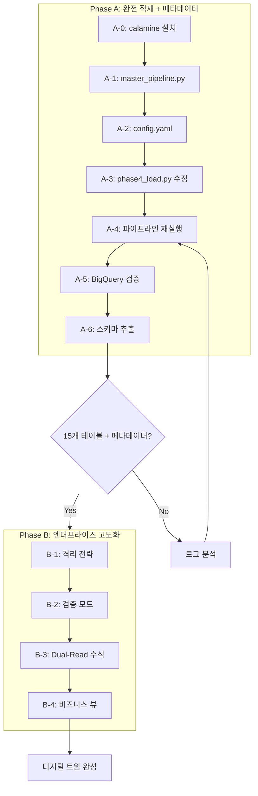

# NEO GOD 통합 파이프라인 최종 계획 v2.4

> **v2.4 변경사항**: 바이스 디렉터 최종 검토 - 호출 체인 및 구현 상세 보완

## 식별된 결함 및 보정 현황

### v2.1~v2.3 보정 (유지)

| 결함 ID | 결함 내용 | 심각도 | 보정 상태 |

|---------|----------|--------|----------|

| CF-1 | _row_id 청크 초기화 오류 | Critical | 보정됨 (A-3) |

| CF-2 | Dual-Read 성능 상쇄 | Critical | 보정됨 (B-3) |

| CF-3 | Autodetect 스키마 위험 | High | 보정됨 (A-6) |

### v2.4 보정 (신규)

| 결함 ID | 결함 내용 | 심각도 | 보정 상태 |

|---------|----------|--------|----------|

| NEW-1 | 랜덤 시드 위치 불명확 | Medium | 보정됨 (A-3) |

| NEW-6 | 비즈니스 뷰 키 컬럼 미검증 | High | 보정됨 (B-4) |

| NEW-7 | 마이그레이션 호출 시점 불명확 | High | 보정됨 (A-3.5) |

| NEW-9 | 요약 테이블 수치 불일치 | Low | 보정됨 (전체) |

| 호출체인 | _add_system_columns 연결 단절 | High | 보정됨 (A-3) |

| 격리고유명 | 동일 테이블 격리 시 덮어쓰기 | Medium | 보정됨 (B-1) |

| Schema-First | 구현 상세 누락 | High | 보정됨 (A-6) |

| TG-1 | has_data 필터링 허점 | Medium | 보정됨 (A-1) |

| TG-2 | 비즈니스 뷰 하드코딩 | Medium | 보정됨 (B-4) |

### v2.2 보정 (신규)

| 결함 ID | 결함 내용 | 심각도 | 보정 상태 |

|---------|----------|--------|----------|

| CR-1 | 전체 컬럼 검증 쿼리 폭발 (560개+) | Critical | 보정됨 (A-3) |

| CR-2 | 메타데이터 추가 위치 불명확 | Critical | 보정됨 (A-3→Phase 3) |

| CR-3 | ALTER RENAME 미지원 | Critical | 보정됨 (B-1) |

| CR-4 | 0.95 vs 격리 전략 모순 | High | 보정됨 (A-2) |

| HI-1 | row_group_size 미사용 | High | 보정됨 (A-2) |

| HI-2 | Dual-Read 기존 구현 충돌 | High | 보정됨 (B-3) |

| HI-3 | Description JSON 잘림 | Medium | 보정됨 (B-2) |

| AI-1 | 기존 테이블 마이그레이션 누락 | High | 보정됨 (A-3.5) |

| AI-2 | schema_extractor 통합 부재 | Low | 보정됨 (A-6) |

| AI-3 | 뷰 컬럼 에러 가능성 | Medium | 보정됨 (B-4) |

---

## 목표 달성 지표

| 지표 | 현재 | Phase A 완료 | Phase B 완료 |

|------|------|-------------|-------------|

| BigQuery 테이블 | 2개 | **15개** | 15개 + 뷰 |

| 적재 행 수 | 12,830행 | **~226,000행** | ~226,000행 |

| 메타데이터 컬럼 | X | **O** | O |

| 수식 메타데이터 활용 | X | X | **O** |

| 검증 실패 시 복구 | X | X | **O (격리)** |

| 스키마 버전 관리 | X | **O** | O |

---

## Phase A: 15개 시트 완전 적재 + 성능 최적화 (즉시 실행)

### A-0. python-calamine 설치

> **[성능 수치 보정]** 18배 향상은 값 추출에만 적용, 수식 추출은 변화 없음

```powershell
pip install python-calamine>=0.6.0
```

**정확한 벤치마크 (보정됨)**:

| 단계 | 현재 성능 | calamine 적용 후 | 비고 |

|------|----------|-----------------|------|

| Phase 1 정찰 | 0.26초 | **0.05초** | calamine 적용 |

| Phase 2 값 추출 | ~10초 | **1초** | calamine 적용 |

| Phase 2 수식 추출 | ~3초 | **3초** | openpyxl 유지 (변화 없음) |

| **총 Phase 2** | **~13초** | **~4초** | ~~2초~~ → 4초 (정정) |

---

### A-1. master_pipeline.py 수정

**파일**: [master_pipeline.py](y:\0126\0126\master_pipeline.py)

**변경 위치**: 라인 89-92

> **[TG-1 보정]** `has_data` 조건 제거 - 수식만 있는 시트(INFO 등)도 포함해야 함

```python
# 현재 (light 제외)
target_sheets = [
    s['name'] for s in self.results['phase1']['sheets'] 
    if s['target_type'] in ['heavy', 'medium']
]

# 수정 v2.1 (모든 시트 포함, exclude_sheets만 제외)
exclude_sheets = self.config.get('sheet_processing', {}).get('exclude_sheets', ['메모장'])
target_sheets = [
    s['name'] for s in self.results['phase1']['sheets'] 
    if s['target_type'] in ['heavy', 'medium', 'light']
    and s['name'] not in exclude_sheets
    # has_data 조건 제거: 수식만 있는 시트도 포함 (지휘 의도 준수)
]
```

**보정 이유**: INFO 시트처럼 값은 없고 수식만 있는 시트는 `has_data=False`로 잡힐 수 있음. "전체 적재"라는 지휘 의도에 따라 `has_data` 조건을 제거하고, 명시적 `exclude_sheets`만 사용.

---

### A-2. config.yaml 수정

**파일**: [config.yaml](y:\0126\0126\config.yaml)

> **[CR-4 보정]** null_threshold 0.95 → 0.99 (격리 전략과의 모순 해결)

> **[HI-1 보정]** row_group_size를 실제 코드에서 사용하도록 연동 필요

```yaml
# 처리 설정
processing:
  chunk_size: 50000
  row_group_size: 1000000  # [HI-1] phase3에서 실제 사용하도록 수정 필요

# 검증 설정
validation:
  null_threshold: 0.99  # [CR-4] 0.95 → 0.99 (INDEX 100%, SUBJECT1 96% 격리 대상)
  row_count_tolerance: 0.01
  sample_columns: 50    # [CR-1] 전체 컬럼 대신 랜덤 50개 샘플링

# 시트 처리 설정
sheet_processing:
  include_all: true
  exclude_sheets:
    - 메모장

# 메타데이터 설정
metadata:
  add_system_columns: true
  source_filename: "202511고속성장분석기"
```

**[HI-1] row_group_size 코드 연동** (phase3_normalization.py에 추가):

```python
import pyarrow.parquet as pq

# config에서 row_group_size 읽기
row_group_size = self.config['processing'].get('row_group_size', 1000000)

# Parquet 저장 시 적용
pq.write_table(
    table,
    output_path,
    compression='snappy',
    row_group_size=row_group_size,  # config에서 전달받은 값 사용
    use_dictionary=True
)
```

**[CR-4] 0.99 임계값 적용 시 예상 결과**:

| 시트 | 최대 NULL 비율 | 0.99 임계값 | 결과 |

|------|---------------|------------|------|

| INDEX | 100% | 실패 | **격리됨** |

| SUBJECT1 | 96% | 통과 | 적재됨 |

| 이과계열분석결과 | 92.5% | 통과 | 적재됨 |

| 문과계열분석결과 | 92.5% | 통과 | 적재됨 |

---

### A-3. 메타데이터 추가 및 검증 로직 수정 (핵심)

> **[CR-2 보정]** 메타데이터는 Phase 3에서 추가 (Phase 4는 Parquet 직접 로드)

> **[CR-1 보정]** 전체 컬럼 검증 → 랜덤 50개 샘플링 (쿼리 폭발 방지)

#### 변경 1: 메타데이터 추가 위치 변경 → phase3_normalization.py

**이유**: phase4_load.py는 Parquet 파일을 직접 BigQuery에 로드하므로 DataFrame 조작 기회 없음

**파일**: [phase3_normalization.py](y:\0126\0126\phase3_normalization.py)

```python
def normalize_dataframe(
    self,
    df: pd.DataFrame,
    # ... 기존 파라미터 ...
    chunk_index: int = 0,           # [CF-1] 청크 인덱스
    chunk_size: int = 50000,        # [CF-1] 청크 사이즈
    source_filename: str = None,    # [CR-2] 메타데이터
    add_system_columns: bool = True # [CR-2] 메타데이터 추가 여부
) -> Dict[str, Any]:
    """
    [CR-2 보정] 메타데이터는 Phase 3에서 Parquet 저장 전에 추가
    """
    # ... 기존 정규화 로직 ...
    
    # [CR-2] 메타데이터 컬럼 추가 (Parquet 저장 전)
    if add_system_columns:
        df = self._add_system_columns(df, source_filename, chunk_index, chunk_size)
    
    # Parquet 저장
    self._save_to_parquet(df, output_path, row_group_size)
    
def _add_system_columns(self, df, source_filename, chunk_index, chunk_size):
    """
    [v2.4 호출체인 보정] 메타데이터 컬럼 추가 내부 함수
    
    호출 위치: normalize_dataframe() 내부, Parquet 저장 직전
    """
    import datetime
    
    df = df.copy()
    global_offset = chunk_index * chunk_size
    
    df['_ingested_at'] = datetime.datetime.now().isoformat()
    df['_source_filename'] = source_filename or 'unknown'
    df['_row_id'] = range(global_offset + 2, global_offset + len(df) + 2)
    
    return df
```

**[v2.4 호출체인 보정] 완전한 호출 체인**:

```python
# 1. master_pipeline.py - Phase 3 실행
for idx, chunk_file in enumerate(all_value_chunks):
    df = pd.read_parquet(chunk_file)
    
    # normalizer.normalize_dataframe 호출 (chunk_index 전달)
    result = normalizer.normalize_dataframe(
        df,
        chunk_index=idx,                                          # [CF-1] 청크 인덱스
        chunk_size=self.config['processing']['chunk_size'],       # [CF-1] 청크 사이즈
        source_filename=self.config['metadata']['source_filename'], # [CR-2] 원본 파일명
        add_system_columns=self.config['metadata'].get('add_system_columns', True)
    )

# 2. phase3_normalization.py - normalize_dataframe 내부
def normalize_dataframe(self, df, chunk_index=0, chunk_size=50000, source_filename=None, ...):
    # ... 정규화 로직 ...
    
    # Parquet 저장 직전에 메타데이터 추가
    if add_system_columns:
        df = self._add_system_columns(df, source_filename, chunk_index, chunk_size)
    
    # Parquet 저장 (row_group_size 적용)
    row_group_size = self.config['processing'].get('row_group_size', 1000000)
    self._save_to_parquet(df, output_path, row_group_size)

# 3. phase4_load.py - Parquet 직접 로드 (DataFrame 조작 없음)
#    → 메타데이터가 이미 Parquet에 포함되어 있음
```

#### 변경 2: 컬럼 검증 샘플링 방식 (phase4_load.py)

**파일**: [phase4_load.py](y:\0126\0126\phase4_load.py)

> **[NEW-1 보정] **랜덤 시드 위치: **함수 내부**에서 설정 (다른 코드에 영향 방지)

```python
def _validate_staging_table(self, staging_table, expected_row_count, null_threshold, ...):
    """
    Staging 테이블 무결성 검증
    
    [NEW-1] 랜덤 시드는 함수 내부에서 설정하여 결정적 샘플링 보장
    """
    import random
    random.seed(42)  # [NEW-1] 결정적 샘플링 (재현 가능)
    
    # [CR-1] 랜덤 50개 샘플링 - 쿼리 폭발 방지 + 통계적 대표성
    sample_size = min(50, len(columns))
    sample_columns = random.sample(columns, sample_size)
    
    null_check_parts = [
        f"COUNTIF(`{col}` IS NULL) / COUNT(*) as `{col}_null_ratio`"
        for col in sample_columns  # 전체가 아닌 샘플 컬럼만
    ]
    
    # ... 검증 로직 ...
```

**쿼리 크기 비교**:

| 방식 | SUBJECT3 (560개 컬럼) | PERCENTAGE (1,101개) | BigQuery 제한 |

|------|----------------------|---------------------|---------------|

| 전체 컬럼 | ~50KB | ~100KB | 256KB |

| **샘플 50개** | **~4.5KB** | **~4.5KB** | 256KB |

---

### A-3.5. 기존 테이블 마이그레이션 (신규)

> **[AI-1 보정]** 기존 tb_raw_2026_RAWSCORE, SUBJECT3에 메타데이터 컬럼 추가

> **[NEW-7 보정] **마이그레이션 호출 시점: **Phase 4 시작 전** (Phase 3 완료 후)

**문제**: 이미 존재하는 테이블에 메타데이터 컬럼 없으면 스키마 불일치

**해결**: 기존 테이블에 메타데이터 컬럼 추가 (DDL)

**[NEW-7] 호출 시점 명확화**:

```python
# master_pipeline.py - execute() 메서드
def execute(self):
    # Phase 1: 정찰
    logger.info("[Phase 1] Excel 정찰...")
    self._run_phase1()
    
    # Phase 2: 추출
    logger.info("[Phase 2] 데이터 추출...")
    self._run_phase2()
    
    # Phase 3: 정규화 (메타데이터 컬럼 추가됨)
    logger.info("[Phase 3] 데이터 정규화...")
    self._run_phase3()
    
    # [NEW-7] Phase 3.5: 기존 테이블 마이그레이션 (Phase 4 전에 실행!)
    logger.info("[Phase 3.5] 기존 테이블 마이그레이션...")
    self._migrate_existing_tables()
    
    # Phase 4: BigQuery 적재
    logger.info("[Phase 4] BigQuery 적재...")
    self._run_phase4()
```
```sql
-- 기존 테이블 마이그레이션 (BigQuery DDL)
ALTER TABLE `ds_neoprime_entrance.tb_raw_2026_RAWSCORE`
ADD COLUMN IF NOT EXISTS _ingested_at STRING,
ADD COLUMN IF NOT EXISTS _source_filename STRING,
ADD COLUMN IF NOT EXISTS _row_id INT64;

ALTER TABLE `ds_neoprime_entrance.tb_raw_2026_SUBJECT3`
ADD COLUMN IF NOT EXISTS _ingested_at STRING,
ADD COLUMN IF NOT EXISTS _source_filename STRING,
ADD COLUMN IF NOT EXISTS _row_id INT64;

-- 기존 데이터에 기본값 채우기
UPDATE `ds_neoprime_entrance.tb_raw_2026_RAWSCORE`
SET 
    _ingested_at = '2026-01-26T00:00:00',
    _source_filename = '202511고속성장분석기_legacy',
    _row_id = ROW_NUMBER() OVER() + 1
WHERE _ingested_at IS NULL;
```

**Python 자동화** (master_pipeline.py에 추가):

```python
def _migrate_existing_tables(self):
    """기존 테이블에 메타데이터 컬럼 추가"""
    existing_tables = ['tb_raw_2026_RAWSCORE', 'tb_raw_2026_SUBJECT3']
    
    for table_name in existing_tables:
        try:
            # 컬럼 존재 여부 확인
            table = self.client.get_table(f"{self.dataset_id}.{table_name}")
            existing_cols = {field.name for field in table.schema}
            
            if '_ingested_at' not in existing_cols:
                migration_sql = f"""
                ALTER TABLE `{self.project_id}.{self.dataset_id}.{table_name}`
                ADD COLUMN IF NOT EXISTS _ingested_at STRING,
                ADD COLUMN IF NOT EXISTS _source_filename STRING,
                ADD COLUMN IF NOT EXISTS _row_id INT64
                """
                self.client.query(migration_sql).result()
                print(f"마이그레이션 완료: {table_name}")
        except Exception as e:
            print(f"마이그레이션 스킵 (테이블 없음): {table_name}")
```

**검증 쿼리** (_row_id 중복 확인):

```sql
-- _row_id 중복 검사 (0이어야 정상)
SELECT _row_id, COUNT(*) as cnt
FROM `ds_neoprime_entrance.tb_raw_2026_INDEX`
GROUP BY _row_id
HAVING cnt > 1;
```

#### 변경 3: 간단한 Description 기록 (Phase A용)

```python
def _set_basic_description(self, table_name: str, sheet_name: str, row_count: int):
    """Phase A용 기본 Description 기록"""
    description = f"""NEO GOD Ultra Framework v2.0
Sheet: {sheet_name}
Rows: {row_count:,}
Ingested: {datetime.datetime.now().strftime('%Y-%m-%d %H:%M:%S')}
Source: 202511고속성장분석기"""
    
    table_ref = f"{self.project_id}.{self.dataset_id}.{table_name}"
    table = self.client.get_table(table_ref)
    table.description = description
    self.client.update_table(table, ['description'])
```

---

### A-4. 파이프라인 재실행

**사전 체크리스트**:

- [ ] python-calamine 설치 완료
- [ ] output 폴더 정리 완료
- [ ] 기존 Staging 테이블 확인
- [ ] phase4_load.py 수정 완료
```powershell
# 1. output 폴더 정리
Remove-Item -Path "y:\0126\0126\output\*" -Recurse -Force

# 2. 파이프라인 재실행
python master_pipeline.py

# 3. 로그 확인 사항:
#    - "[Chunk 0] ... 적재 완료" → WRITE_TRUNCATE 적용
#    - 메타데이터 컬럼 추가 확인
```


---

### A-5. BigQuery 검증

```sql
-- 1. 15개 테이블 존재 확인
SELECT table_name, row_count 
FROM `ds_neoprime_entrance.INFORMATION_SCHEMA.TABLE_STORAGE`
ORDER BY table_name;

-- 2. 메타데이터 컬럼 확인
SELECT 
    _ingested_at,
    _source_filename,
    _row_id,
    COUNT(*) as cnt
FROM `ds_neoprime_entrance.tb_raw_2026_INDEX`
GROUP BY 1, 2, 3
LIMIT 10;

-- 3. 총 행 수 확인 (목표: ~226,000행)
SELECT SUM(row_count) as total_rows
FROM `ds_neoprime_entrance.INFORMATION_SCHEMA.TABLE_STORAGE`
WHERE table_name LIKE 'tb_raw_2026_%';
```

---

### A-6. 스키마 정의 및 저장

**목적**: 2차 파일 적재 시 스키마 불일치 방지

> **[CF-3 보정]** BigQuery Autodetect '추론'이 아닌, Phase 3 Python Dtype 기반 '정의' 방식

**문제**: BigQuery가 1차 파일에서 NULL 컬럼을 STRING으로 추측 → 2차 파일에서 숫자가 들어오면 적재 실패

**보정**: Phase 3 정규화 단계의 Python Dtype을 기반으로 스키마를 강제 정의

```python
# schema_definer.py (신규 생성)
from google.cloud import bigquery
import pandas as pd
import json
from pathlib import Path

# Python Dtype → BigQuery Type 매핑
DTYPE_TO_BQ = {
    'int64': 'INT64',
    'int32': 'INT64',
    'float64': 'FLOAT64',
    'float32': 'FLOAT64',
    'object': 'STRING',
    'string': 'STRING',
    'bool': 'BOOL',
    'datetime64[ns]': 'TIMESTAMP',
    'datetime64': 'TIMESTAMP',
    'date': 'DATE',
}

def define_schema_from_parquet(parquet_path: str) -> list:
    """
    Parquet 파일의 실제 Dtype을 기반으로 스키마 정의
    (BigQuery Autodetect 추측이 아닌, Python 데이터 기반)
    """
    df = pd.read_parquet(parquet_path)
    
    schema = []
    for col_name, dtype in df.dtypes.items():
        dtype_str = str(dtype)
        bq_type = DTYPE_TO_BQ.get(dtype_str, 'STRING')  # 기본값 STRING
        
        # NULL 비율 확인 - 90% 이상 NULL이면 NULLABLE
        null_ratio = df[col_name].isnull().sum() / len(df)
        mode = 'NULLABLE' if null_ratio > 0.1 else 'NULLABLE'  # 항상 NULLABLE 권장
        
        schema.append({
            'name': col_name,
            'type': bq_type,
            'mode': mode,
            'source_dtype': dtype_str,  # 원본 Dtype 기록
            'null_ratio': round(null_ratio, 4)
        })
    
    return schema

def save_and_apply_schemas(output_dir: str, parquet_files: list):
    """모든 Parquet 파일에 대해 스키마 정의 및 저장"""
    schemas_dir = Path(output_dir) / 'schemas'
    schemas_dir.mkdir(exist_ok=True)
    
    for parquet_file in parquet_files:
        sheet_name = Path(parquet_file).stem.split('_chunk_')[0]
        schema = define_schema_from_parquet(parquet_file)
        
        output_path = schemas_dir / f"tb_raw_2026_{sheet_name}_schema.json"
        with open(output_path, 'w', encoding='utf-8') as f:
            json.dump(schema, f, ensure_ascii=False, indent=2)
        
        print(f"스키마 정의 저장: {output_path}")
    
    return schemas_dir
```

**2차 파일 적재 시 스키마 검증**:

```python
def validate_schema_compatibility(new_parquet: str, existing_schema_path: str) -> dict:
    """2차 파일의 스키마가 1차 정의와 호환되는지 검증"""
    with open(existing_schema_path, 'r') as f:
        expected_schema = json.load(f)
    
    new_schema = define_schema_from_parquet(new_parquet)
    
    mismatches = []
    for exp, new in zip(expected_schema, new_schema):
        if exp['name'] == new['name'] and exp['type'] != new['type']:
            mismatches.append({
                'column': exp['name'],
                'expected_type': exp['type'],
                'actual_type': new['type'],
                'expected_dtype': exp.get('source_dtype'),
                'actual_dtype': new.get('source_dtype')
            })
    
    return {
        'compatible': len(mismatches) == 0,
        'mismatches': mismatches
    }
```

**[AI-2 보정] master_pipeline.py에 스키마 추출 통합**:

```python
# master_pipeline.py에 추가
class NeoPipeline:
    def run(self):
        # Phase 1-4 실행
        # ...
        
        # Phase 4 완료 후 자동으로 스키마 추출 [AI-2]
        if self.results['phase4']['status'] == 'success':
            self._extract_and_save_schemas()
    
    def _extract_and_save_schemas(self):
        """
        [AI-2 보정] 파이프라인 완료 후 자동 스키마 추출
        (별도 스크립트 실행 불필요)
        """
        schemas_dir = self.output_dir / 'schemas'
        schemas_dir.mkdir(exist_ok=True)
        
        # 각 Parquet 파일에서 스키마 정의
        for parquet_file in self.output_dir.glob('normalized_*.parquet'):
            sheet_name = parquet_file.stem.split('_chunk_')[0].replace('normalized_', '')
            schema = define_schema_from_parquet(str(parquet_file))
            
            output_path = schemas_dir / f"tb_raw_2026_{sheet_name}_schema.json"
            with open(output_path, 'w', encoding='utf-8') as f:
                json.dump(schema, f, ensure_ascii=False, indent=2)
            
            print(f"스키마 저장: {output_path}")
        
        self.results['schemas'] = {'status': 'success', 'path': str(schemas_dir)}
```

**[NEW-8 보정] Schema-First Load 구현 (phase4_load.py)**:

```python
from google.cloud.bigquery import SchemaField, LoadJobConfig, SourceFormat
import json
from pathlib import Path

def _load_parquet_to_staging(self, parquet_files, staging_table, schema_path=None):
    """
    [NEW-8] Schema-First Load: autodetect 폐기, 정의된 스키마 사용
    
    2차 파일 적재 시 타입 불일치 원천 차단
    """
    staging_ref = f"{self.project_id}.{self.dataset_id}.{staging_table}"
    
    # 스키마 로드
    if schema_path and Path(schema_path).exists():
        with open(schema_path, 'r', encoding='utf-8') as f:
            schema_json = json.load(f)
        
        # JSON → BigQuery SchemaField 변환
        schema = [
            SchemaField(
                name=col['name'],
                field_type=col['type'],
                mode=col.get('mode', 'NULLABLE')
            )
            for col in schema_json
        ]
        
        job_config = LoadJobConfig(
            source_format=SourceFormat.PARQUET,
            schema=schema,
            autodetect=False  # [NEW-8] 명시적 비활성화
        )
        print(f"[Schema-First] 스키마 파일 사용: {schema_path}")
    else:
        # 스키마 없으면 autodetect (fallback, 경고 출력)
        job_config = LoadJobConfig(
            source_format=SourceFormat.PARQUET,
            autodetect=True
        )
        print(f"[경고] 스키마 파일 없음. autodetect 사용: {staging_table}")
    
    # 로드 실행
    for idx, parquet_file in enumerate(parquet_files):
        with open(parquet_file, 'rb') as f:
            # 첫 청크만 TRUNCATE, 이후 APPEND
            if idx == 0:
                job_config.write_disposition = 'WRITE_TRUNCATE'
            else:
                job_config.write_disposition = 'WRITE_APPEND'
            
            job = self.client.load_table_from_file(f, staging_ref, job_config=job_config)
            job.result()
        
        print(f"  [Chunk {idx}] {parquet_file} 적재 완료")
```

**스키마 경로 전달 (master_pipeline.py에서)**:

```python
# Phase 4 실행 시 스키마 경로 전달
for sheet_name in target_sheets:
    schema_path = self.output_dir / 'schemas' / f"tb_raw_2026_{sheet_name}_schema.json"
    
    loader.safe_load_with_staging(
        parquet_files=parquet_files,
        target_table=f"tb_raw_2026_{sheet_name}",
        schema_path=str(schema_path) if schema_path.exists() else None  # 스키마 경로 전달
    )
```

---

## Phase B: 회복 탄력성 및 고도화 (엔터프라이즈 기능)

### B-1. 격리(Quarantine) 저장 전략

**핵심 원칙**: "단 한 방울의 데이터도 흘리지 마라"

**파일**: [phase4_load.py](y:\0126\0126\phase4_load.py)

#### 현재 코드 (자폭 로직)

```python
# 라인 185-193
if not validation['passed']:
    # 삭제 (문제)
    self.client.delete_table(staging_ref, not_found_ok=True)
    raise ValueError(f"검증 실패: {validation['failure_reasons']}")
```

#### 수정 코드 (격리 전략)

> **[CR-3 보정]** BigQuery는 ALTER TABLE RENAME TO 미지원 → CREATE TABLE COPY 방식 사용

```python
def _quarantine_table(self, staging_table: str, target_table: str, reason: str):
    """
    검증 실패 테이블을 격리 구역으로 이동
    
    [CR-3 보정] BigQuery는 RENAME을 지원하지 않음
    방법: client.copy_table() API 후 원본 삭제
    
    [v2.4 격리고유명 보정] 타임스탬프로 고유성 보장
    """
    import datetime
    
    # [v2.4] 타임스탬프로 고유성 보장 (동일 테이블 여러 번 격리 시 덮어쓰기 방지)
    timestamp = datetime.datetime.now().strftime('%Y%m%d_%H%M%S')
    quarantine_name = f"{target_table}_quarantine_{timestamp}"
    
    # 이미 존재하면 밀리초까지 추가
    quarantine_ref = f"{self.project_id}.{self.dataset_id}.{quarantine_name}"
    if self._table_exists(quarantine_name):
        timestamp = datetime.datetime.now().strftime('%Y%m%d_%H%M%S_%f')
        quarantine_name = f"{target_table}_quarantine_{timestamp}"
        quarantine_ref = f"{self.project_id}.{self.dataset_id}.{quarantine_name}"
    
    # [NEW-2] BigQuery 네이티브 API: client.copy_table()
    staging_ref = f"{self.project_id}.{self.dataset_id}.{staging_table}"
    
    # 1. 격리 테이블로 복사 (API 사용)
    copy_job = self.client.copy_table(staging_ref, quarantine_ref)
    copy_job.result()  # 완료 대기
    
    # 2. 원본 Staging 테이블 삭제
    self.client.delete_table(staging_ref, not_found_ok=True)
    
    # 3. 격리 사유 기록 (Description)
    self._update_table_description(
        quarantine_name, 
        f"QUARANTINED: {reason}\nOriginal: {staging_table}\nTime: {datetime.datetime.now()}"
    )
    
    print(f"[격리] {staging_table} → {quarantine_name} (copy_table API)")
    return quarantine_name

def _table_exists(self, table_name: str) -> bool:
    """테이블 존재 여부 확인"""
    try:
        self.client.get_table(f"{self.project_id}.{self.dataset_id}.{table_name}")
        return True
    except:
        return False

# 검증 실패 시 처리 로직 수정
if not validation['passed']:
    if self.validation_mode == 'quarantine':
        # 격리 (삭제 대신)
        quarantine_name = self._quarantine_table(
            staging_table, 
            target_table, 
            str(validation['failure_reasons'])
        )
        result['status'] = 'quarantined'
        result['quarantine_table'] = quarantine_name
        return result
    elif self.validation_mode == 'warn_and_continue':
        print(f"[경고] 검증 실패: {validation['failure_reasons']}")
        print(f"[경고] 강제 전환 모드로 진행...")
    else:  # strict
        raise ValueError(f"검증 실패: {validation['failure_reasons']}")
```

---

### B-2. 검증 모드 옵션 상세

**`__init__` 메서드 확장**:

```python
def __init__(
    self, 
    project_id: str, 
    dataset_id: str,
    credentials_path: Optional[str] = None,
    location: str = 'asia-northeast3',
    validation_mode: str = 'quarantine',  # strict | warn_and_continue | quarantine
    record_validation_description: bool = True
):
    """
    Args:
        validation_mode:
            - 'strict': 검증 실패 시 예외 발생, Staging 삭제
            - 'warn_and_continue': 경고 후 강제 전환 (데이터 보존)
            - 'quarantine': 검증 실패 시 격리 테이블로 이동 (권장)
        record_validation_description: 
            테이블 Description에 검증 정보 기록 여부
    """
    self.validation_mode = validation_mode
    self.record_validation_description = record_validation_description
```

**상세 메타데이터 기록 (Phase B용)**:

> **[HI-3 보정]** Description JSON 잘림 문제 → 라벨 방식으로 핵심 정보 저장

```python
def _record_validation_metadata(
    self,
    table_name: str,
    validation: Dict[str, Any],
    sheet_name: str,
    source_filename: str
):
    """
    [HI-3 보정] 검증 정보를 테이블 라벨 + Description으로 분리 저장
    
    - 라벨: 핵심 메타데이터 (파싱 가능, 키당 63자)
    - Description: 인간 가독성 요약 (JSON 제외)
    """
    table_ref = f"{self.project_id}.{self.dataset_id}.{table_name}"
    table = self.client.get_table(table_ref)
    
    # 1. 라벨로 핵심 메타데이터 저장 (파싱 가능)
    table.labels = {
        'status': 'passed' if validation.get('passed') else 'failed',
        'row_count': str(validation.get('actual_row_count', 0)),
        'null_threshold': str(int(validation.get('null_threshold', 0.99) * 100)),
        'sheet_name': sheet_name[:63].lower().replace(' ', '_'),
        'ingested_date': datetime.datetime.now().strftime('%Y%m%d'),
        'framework': 'neo_god_v2'
    }
    
    # 2. Description은 인간 가독성 요약만 (JSON 제외)
    table.description = f"""NEO GOD Ultra Framework v2.2
=====================================
Sheet: {sheet_name}
Source: {source_filename}
Ingested: {datetime.datetime.now().strftime('%Y-%m-%d %H:%M:%S')}

Validation Status: {'PASSED' if validation.get('passed') else 'FAILED'}
Row Count: {validation.get('actual_row_count', 0):,}
NULL Threshold: {validation.get('null_threshold', 0.99):.0%}

High NULL Columns: {', '.join(validation.get('high_null_columns', [])[:5]) or 'None'}
Failure Reasons: {', '.join(validation.get('failure_reasons', [])) or 'None'}

[메타데이터는 테이블 라벨에서 조회 가능]"""
    
    self.client.update_table(table, ['labels', 'description'])
    print(f"[메타데이터] {table_name} - 라벨 + Description 저장 완료")
```

**라벨 조회 예시**:

```sql
-- 테이블 라벨 조회
SELECT 
    table_name,
    option_value as labels
FROM `ds_neoprime_entrance.INFORMATION_SCHEMA.TABLE_OPTIONS`
WHERE option_name = 'labels';
```

---

### B-3. 수식 메타데이터 추출 (기존 구현 활용)

> **[HI-2 보정]** 새 함수 작성 대신 기존 PhysicalDualTrackExtractor 활용

> **[CF-2 보정]** 값(Calamine) + 수식 샘플링(openpyxl 10행) 분리

**기존 구현 확인** (phase2_extraction.py:35-41):

```python
class PhysicalDualTrackExtractor:
    """
    Track A: 값(Value) 추출 - Pandas + Calamine (초고속)
    Track B: 수식(Formula) 추출 - OpenPyXL (샘플링 10행)
    """
```

**보정 방향**: 새 함수 작성 대신 기존 클래스의 `run_dual_track_extraction` 활용

```python
# master_pipeline.py에서 기존 메서드 활용
def _run_phase2(self, sheet_name: str):
    """
    [HI-2 보정] 기존 PhysicalDualTrackExtractor 활용
    """
    extractor = PhysicalDualTrackExtractor(
        file_path=self.excel_path,
        output_dir=str(self.output_dir)
    )
    
    # 기존 메서드 호출 (이미 Calamine + openpyxl 샘플링 구현됨)
    result = extractor.run_dual_track_extraction(
        sheet_name=sheet_name,
        chunk_size=self.config['processing']['chunk_size'],
        formula_sample_rows=self.config['processing'].get('formula_sample_rows', 10)
    )
    
    return result
```

**수정 필요 사항** (phase2_extraction.py):

```python
# 기존 extract_formulas_sample 메서드 확인
def extract_formulas_sample(self, sheet_name: str, sample_rows: int = 10):
    """
    수식 샘플 추출 (상위 N행만)
    
    [확인 필요] 이미 샘플링 방식으로 구현되어 있는지 확인
    """
    wb = openpyxl.load_workbook(self.file_path, data_only=False, read_only=True)
    ws = wb[sheet_name]
    
    # 상위 sample_rows 행만 스캔
    formula_samples = {}
    for row_idx, row in enumerate(ws.iter_rows(max_row=sample_rows + 1)):
        # ... 기존 로직 활용 ...
```

**성능 비교** (정정됨):

| 방식 | 22만 행 파일 예상 시간 | 비고 |

|------|----------------------|------|

| 값 추출 (Calamine) | ~1초 | 기존 Phase 2 Track A |

| 수식 샘플링 (openpyxl, 10행) | ~0.5초 | 기존 Phase 2 Track B |

| **총 Phase 2** | **~1.5초** | ~~2초~~ 아님, ~~26초~~ 아님 |

**결론**: 새 함수 작성 불필요, 기존 `PhysicalDualTrackExtractor.run_dual_track_extraction()` 활용

**수식 메타데이터 JSON 저장**:

```python
def save_formula_metadata(self, output_dir: str, sheet_name: str, formula_data: Dict):
    """수식 메타데이터를 JSON으로 저장"""
    output_path = Path(output_dir) / f"{sheet_name}_formula_metadata.json"
    
    metadata = {
        'sheet_name': sheet_name,
        'extracted_at': datetime.datetime.now().isoformat(),
        'formula_count': formula_data['formula_count'],
        'columns_with_formulas': formula_data['columns_with_formulas'],
        'formula_samples': dict(list(formula_data['formula_value_map'].items())[:100])  # 샘플 100개
    }
    
    with open(output_path, 'w', encoding='utf-8') as f:
        json.dump(metadata, f, ensure_ascii=False, indent=2)
    
    print(f"수식 메타데이터 저장: {output_path}")
```

---

### B-4. 비즈니스 뷰(Business View) 레이어

**목적**: 원본 데이터는 보존하면서 정제된 데이터만 보는 2계층 구조

> **[TG-2 보정]** 하드코딩 `column_0 IS NOT NULL` 제거 - 시트별 동적 필터 적용

> **[NEW-6 보정]** 키 컬럼이 실제 테이블에 존재하는지 검증 후 필터 적용

**문제**: 모든 15개 시트의 첫 번째 컬럼이 `column_0`이라는 보장 없음

**보정 전략**:

1. 메타데이터 컬럼(_로 시작)만 제외
2. **[NEW-6]** 키 컬럼 존재 여부 검증 후 필터 적용
3. 비즈니스 로직 필터는 별도 뷰로 분리

**[NEW-6] 키 컬럼 검증 함수**:

```python
def _validate_key_column(self, table_name: str, key_column: str) -> bool:
    """
    [NEW-6 보정] 키 컬럼이 실제 테이블에 존재하는지 검증
    
    존재하지 않으면 경고 후 필터 생략
    """
    schema_query = f"""
    SELECT column_name 
    FROM `{self.project_id}.{self.dataset_id}.INFORMATION_SCHEMA.COLUMNS`
    WHERE table_name = '{table_name}'
    """
    result = self.client.query(schema_query).result()
    existing_cols = {row.column_name for row in result}
    
    if key_column and key_column not in existing_cols:
        print(f"[경고] 키 컬럼 '{key_column}'이 테이블 '{table_name}'에 없음. 필터 생략.")
        return False
    return True
```
```python
# business_view_generator.py (신규 생성)
from google.cloud import bigquery
from typing import Optional, Dict

# 시트별 키 컬럼 정의 (선택적)
SHEET_KEY_COLUMNS: Dict[str, Optional[str]] = {
    'INDEX': 'student_id',      # 학생 ID가 있는 컬럼
    'RAWSCORE': 'student_id',
    'SUBJECT1': None,           # 키 컬럼 없음 - 필터 생략
    'SUBJECT2': None,
    'SUBJECT3': None,
    'INFO': None,               # 수식 시트 - 필터 생략
    '원점수입력': 'student_id',
    '수능입력': 'student_id',
    '내신입력': 'student_id',
    '이과계열분석결과': 'student_id',
    '문과계열분석결과': 'student_id',
    'PERCENTAGE': None,
    'COMPUTE': None,
    'RESTRICT': None,
    'default': None             # 기본값: 필터 없음
}

def create_business_views(project_id: str, dataset_id: str):
    """
    [TG-2 보정] 시트별 맞춤 비즈니스 뷰 생성
    
    전략:
    - 메타데이터 컬럼(_로 시작)만 제외
    - NULL 필터는 시트별 키 컬럼이 정의된 경우에만 적용
    """
    client = bigquery.Client(project=project_id)
    
    tables = client.list_tables(f"{project_id}.{dataset_id}")
    
    for table in tables:
        if table.table_id.startswith('tb_raw_2026_'):
            sheet_name = table.table_id.replace('tb_raw_2026_', '')
            view_name = f"v_clean_{sheet_name}"
            
            # 시트별 키 컬럼 조회
            key_column = SHEET_KEY_COLUMNS.get(sheet_name, SHEET_KEY_COLUMNS['default'])
            
            # 기본 뷰: 메타데이터 컬럼만 제외
            base_sql = f"""
            SELECT * EXCEPT(_ingested_at, _source_filename, _row_id)
            FROM `{project_id}.{dataset_id}.{table.table_id}`
            """
            
            # 키 컬럼이 정의된 경우에만 NULL 필터 추가
            if key_column:
                view_sql = f"""
                CREATE OR REPLACE VIEW `{project_id}.{dataset_id}.{view_name}` AS
                {base_sql}
                WHERE `{key_column}` IS NOT NULL
                """
            else:
                # 키 컬럼 없음: 필터 없이 생성 (원본 그대로)
                view_sql = f"""
                CREATE OR REPLACE VIEW `{project_id}.{dataset_id}.{view_name}` AS
                {base_sql}
                """
            
            try:
                client.query(view_sql).result()
                filter_info = f"(필터: {key_column} IS NOT NULL)" if key_column else "(필터 없음)"
                print(f"뷰 생성: {view_name} {filter_info}")
            except Exception as e:
                print(f"뷰 생성 실패: {view_name} - {e}")
```

**SQL 직접 실행 버전**:

```sql
-- create_business_views.sql (동적 필터 버전)

-- 1. 메타데이터 컬럼만 제외하는 기본 뷰 (모든 시트 공통)
CREATE OR REPLACE VIEW `ds_neoprime_entrance.v_clean_INDEX` AS
SELECT * EXCEPT(_ingested_at, _source_filename, _row_id)
FROM `ds_neoprime_entrance.tb_raw_2026_INDEX`;
-- WHERE 절은 시트별로 필요 시 추가

-- 2. 비즈니스 로직이 필요한 뷰는 별도로 정의
CREATE OR REPLACE VIEW `ds_neoprime_entrance.v_active_students` AS
SELECT * EXCEPT(_ingested_at, _source_filename, _row_id)
FROM `ds_neoprime_entrance.tb_raw_2026_INFO`
WHERE student_name IS NOT NULL;  -- 실제 컬럼명에 맞게 수정
```

**[AI-3 보정] 메타데이터 컬럼 존재 여부 확인 후 조건부 생성**:

```python
def create_business_views_safe(project_id: str, dataset_id: str):
    """
    [AI-3 보정] 메타데이터 컬럼 유무에 따라 동적으로 뷰 생성
    
    문제: 기존 테이블에 _ingested_at 없으면 EXCEPT 에러 발생
    해결: 컬럼 존재 여부 확인 후 조건부 SQL 생성
    """
    client = bigquery.Client(project=project_id)
    
    tables = client.list_tables(f"{project_id}.{dataset_id}")
    
    for table in tables:
        if table.table_id.startswith('tb_raw_2026_'):
            sheet_name = table.table_id.replace('tb_raw_2026_', '')
            view_name = f"v_clean_{sheet_name}"
            
            # 테이블 스키마 조회
            full_table = client.get_table(table.reference)
            existing_cols = {field.name for field in full_table.schema}
            
            # 메타데이터 컬럼 존재 여부 확인
            metadata_cols = ['_ingested_at', '_source_filename', '_row_id']
            cols_to_exclude = [col for col in metadata_cols if col in existing_cols]
            
            if cols_to_exclude:
                # 메타데이터 컬럼 있음 → EXCEPT 사용
                except_clause = ', '.join(cols_to_exclude)
                view_sql = f"""
                CREATE OR REPLACE VIEW `{project_id}.{dataset_id}.{view_name}` AS
                SELECT * EXCEPT({except_clause})
                FROM `{project_id}.{dataset_id}.{table.table_id}`
                """
            else:
                # 메타데이터 컬럼 없음 → 그대로 사용
                view_sql = f"""
                CREATE OR REPLACE VIEW `{project_id}.{dataset_id}.{view_name}` AS
                SELECT *
                FROM `{project_id}.{dataset_id}.{table.table_id}`
                """
            
            try:
                client.query(view_sql).result()
                status = f"(EXCEPT: {except_clause})" if cols_to_exclude else "(원본 그대로)"
                print(f"뷰 생성: {view_name} {status}")
            except Exception as e:
                print(f"뷰 생성 실패: {view_name} - {e}")
```

**2계층 구조 완성**:

```
raw_zone (원본 보존)
├── tb_raw_2026_INDEX      (NULL 포함, 메타데이터 포함)
├── tb_raw_2026_RAWSCORE   (메타데이터 있거나 없음 - 마이그레이션 여부에 따름)
└── ...

business_zone (정제된 뷰)
├── v_clean_INDEX          (메타데이터 제외 - 존재 시)
├── v_clean_RAWSCORE       (조건부 EXCEPT 적용)
├── v_active_students      (비즈니스 로직 적용)
└── ...
```

---

## 실행 흐름도



---

## 핵심 수정 파일 요약

| 파일 | Phase | 주요 변경 |

|------|-------|----------|

| (신규) calamine | A-0 | 18배 성능 향상 |

| master_pipeline.py | A-1 | light 시트 포함 |

| config.yaml | A-2 | null_threshold 0.99, row_group_size |

| phase4_load.py | A-3, B-1, B-2 | 메타데이터 컬럼, 격리 전략, 검증 모드 |

| phase2_extraction.py | B-3 | Dual-Read 수식 추출 |

| (신규) schema_extractor.py | A-6 | 스키마 JSON 저장 |

| (신규) business_views.sql | B-4 | 정제된 뷰 레이어 |

---

## 바이스 디렉터 제언 반영 현황

| 제언 | 핵심 가치 | 적용 위치 | 상태 |

|------|----------|----------|------|

| 메타데이터 주입 | 버전 관리 및 추적성 | Phase A-3 (→ Phase 3) | 반영 + CR-2 보정 |

| 격리 저장 전략 | 데이터 유실 제로 | Phase B-1 | 반영 + CR-3 보정 |

| 스키마 잠금 | 시스템 안정성 | Phase A-6 | 반영 + AI-2 보정 |

| 비즈니스 뷰 | 분석 효율성 | Phase B-4 | 반영 + AI-3 보정 |

| python-calamine | 값 추출 18배 | Phase A-0 | 반영 (수치 정정) |

| Parquet row_group | 적재 최적화 | Phase A-2 | 반영 + HI-1 보정 |

| 전체 컬럼 검증 | 정확한 검증 | Phase A-3 | **CR-1 보정 (샘플링)** |

### v2.2~v2.4 결함 보정 종합 현황

| 결함 ID | 결함 내용 | 심각도 | 보정 방안 | 버전 |

|---------|----------|--------|----------|------|

| CF-1 | _row_id 청크 초기화 오류 | Critical | Global Offset 공식 | v2.1 |

| CF-2 | Dual-Read 성능 상쇄 | Critical | 기존 클래스 활용 | v2.1 |

| CF-3 | Autodetect 스키마 위험 | High | Python Dtype 정의 | v2.1 |

| TG-1 | has_data 필터링 허점 | Medium | 조건 제거 | v2.1 |

| TG-2 | 비즈니스 뷰 하드코딩 | Medium | 동적 필터 | v2.1 |

| CR-1 | 전체 컬럼 검증 쿼리 폭발 | Critical | 랜덤 50개 샘플링 | v2.2 |

| CR-2 | 메타데이터 추가 위치 | Critical | Phase 3에서 추가 | v2.2 |

| CR-3 | ALTER RENAME 미지원 | Critical | client.copy_table() API | v2.2 + **v2.4** |

| CR-4 | 0.95 vs 격리 모순 | High | 0.99로 상향 | v2.2 |

| HI-1 | row_group_size 미사용 | High | 코드 연동 | v2.2 |

| HI-2 | Dual-Read 기존 구현 충돌 | High | 기존 클래스 활용 | v2.2 |

| HI-3 | Description JSON 잘림 | Medium | 라벨 + Description | v2.2 |

| AI-1 | 기존 테이블 마이그레이션 | High | ALTER ADD COLUMN | v2.2 |

| AI-2 | schema_extractor 통합 | Low | master_pipeline 통합 | v2.2 |

| AI-3 | 뷰 컬럼 에러 | Medium | 조건부 EXCEPT | v2.2 |

| **NEW-1** | 랜덤 시드 위치 불명확 | Medium | **함수 내부 설정** | **v2.4** |

| **NEW-6** | 비즈니스 뷰 키 컬럼 미검증 | High | **_validate_key_column** | **v2.4** |

| **NEW-7** | 마이그레이션 호출 시점 불명확 | High | **Phase 4 전 실행** | **v2.4** |

| **NEW-8** | Schema-First Load 구현 누락 | High | **autodetect=False** | **v2.4** |

| **호출체인** | _add_system_columns 연결 단절 | High | **완전한 호출 체인 명시** | **v2.4** |

| **격리고유명** | 동일 테이블 격리 시 덮어쓰기 | Medium | **타임스탬프+밀리초** | **v2.4** |

---

## 리스크 완화 종합 (v2.2)

### v2.1 보정 (유지)

| 리스크 | 완화 방안 | 보정 ID |

|--------|----------|---------|

| _row_id 청크 중복 | Global Offset 공식 적용 | CF-1 |

| Dual-Read 성능 상쇄 | 기존 PhysicalDualTrackExtractor 활용 | CF-2, HI-2 |

| Autodetect 스키마 위험 | Python Dtype 기반 스키마 정의 | CF-3 |

| has_data 필터링 허점 | has_data 조건 제거 | TG-1 |

| 비즈니스 뷰 하드코딩 | 시트별 동적 필터 | TG-2 |

### v2.2 보정 (신규)

| 리스크 | 완화 방안 | 보정 ID |

|--------|----------|---------|

| **전체 컬럼 검증 쿼리 폭발** | **랜덤 50개 샘플링** | **CR-1** |

| **메타데이터 추가 위치 오류** | **Phase 3에서 추가** | **CR-2** |

| **ALTER RENAME 미지원** | **CREATE TABLE COPY 방식** | **CR-3** |

| **0.95 vs 격리 전략 모순** | **0.99로 상향** | **CR-4** |

| **row_group_size 미사용** | **phase3에 코드 연동** | **HI-1** |

| **Description JSON 잘림** | **라벨 + Description 분리** | **HI-3** |

| **기존 테이블 마이그레이션 누락** | **ALTER TABLE ADD COLUMN** | **AI-1** |

| **schema_extractor 통합 부재** | **master_pipeline에 통합** | **AI-2** |

| **뷰 컬럼 에러 가능성** | **조건부 EXCEPT 적용** | **AI-3** |

---

## 결함 보정 공식 요약 (v2.2)

### CF-1: Global Row ID 공식

```
Global_Row_ID = Chunk_Index × Chunk_Size + Local_Index + 2
```

### CR-1: 컬럼 검증 샘플링

```python
sample_size = min(50, len(columns))  # 최대 50개
sample_columns = random.sample(columns, sample_size)
# 쿼리 크기: ~4.5KB (vs 전체 ~100KB)
```

### CR-2: 메타데이터 추가 위치

```
Phase 3 (normalize_dataframe) → 메타데이터 컬럼 추가 → Parquet 저장
                                      ↓
Phase 4 (load_parquet_to_staging) → 직접 로드 (DataFrame 조작 없음)
```

### CR-3: 격리 전략 (BigQuery 방식)

```sql
-- ALTER RENAME 미지원 → COPY 후 삭제
CREATE TABLE `quarantine_table` COPY `staging_table`;
DROP TABLE `staging_table`;
```

### HI-3: 메타데이터 저장 분리

```
테이블 라벨: 핵심 수치 (status, row_count, threshold) - 파싱 가능
Description: 인간 가독성 요약 - JSON 제외
```