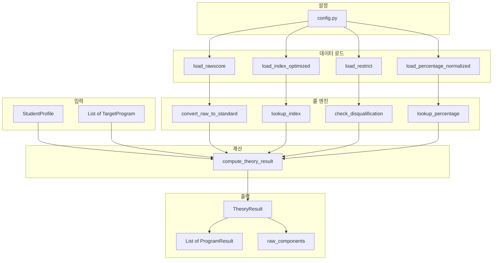

# NeoPrime Theory Engine v2 - 최종 설계

## 프로젝트 구조

```
C:\Neoprime\
├── theory_engine/
│   ├── __init__.py
│   ├── config.py       # NEW: 시트별 설정, 버전 관리
│   ├── loader.py       # 엑셀 로더 (보완: 헤더/타입 설정)
│   ├── model.py        # 입출력 모델 (보완: 다중 대학, 버전 태깅)
│   ├── rules.py        # 룰 엔진 (보완: INDEX 최적화, PERCENTAGE 정규화)
│   └── utils.py        # NEW: 타입 캐스팅, 로깅 유틸
├── tests/
│   ├── data/
│   │   └── golden_cases.xlsx  # NEW: 골든 레코드
│   └── test_theory_engine.py
└── 202511고속성장분석기(가채점)20251114 (1).xlsx
```

---

## 1. config.py - 시트별 설정 및 버전 관리

[`theory_engine/config.py`](C:\Neoprime\theory_engine\config.py)

```python
# 엔진 버전 관리
ENGINE_VERSION = "1.0.0"
EXCEL_VERSION = "202511_가채점_20251114"

# 시트별 헤더/스킵 설정
SHEET_CONFIG = {
    "INFO": {"skip": True},  # 로드 제외
    "원점수입력": {"header": 2, "skiprows": [0, 1]},
    "수능입력": {"header": 2, "skiprows": [0, 1]},
    "내신입력": {"header": 1, "skiprows": [0]},
    "이과계열분석결과": {"header": 2, "skiprows": [0, 1]},
    "문과계열분석결과": {"header": 2, "skiprows": [0, 1]},
    "COMPUTE": {"header": 0, "skiprows": None},
    "RESTRICT": {"header": 0, "skiprows": None},
    "SUBJECT1": {"header": 0, "skiprows": None},
    "SUBJECT2": {"header": 0, "skiprows": None},
    "SUBJECT3": {"header": 0, "skiprows": None},
    "PERCENTAGE": {"header": 1, "skiprows": [0]},
    "INDEX": {"header": 0, "skiprows": None},
    "RAWSCORE": {"header": 0, "skiprows": None},
    "메모장": {"skip": True},
}

# 숫자로 강제 캐스팅할 컬럼 패턴
NUMERIC_PATTERNS = [
    "점수", "표준", "백분위", "등급", "누적", "누백",
    "적정", "예상", "소신", "환산", "원점수"
]

# INDEX 시트 멀티인덱스 컬럼
INDEX_KEY_COLUMNS = ["korean_std", "math_std", "inq1_std", "inq2_std", "track"]
```

---

## 2. loader.py - 엑셀 데이터 로더 (보완)

[`theory_engine/loader.py`](C:\Neoprime\theory_engine\loader.py)

### 핵심 함수

```python
def load_workbook(path: str) -> Dict[str, pd.DataFrame]:
    """
    엑셀 전체를 시트별 DataFrame dict로 반환
    - SHEET_CONFIG 기반 헤더/스킵 적용
    - 숫자 컬럼 자동 캐스팅
    """

def load_rawscore(path: str) -> pd.DataFrame:
    """
    RAWSCORE 시트 로드
    - 키 컬럼: (영역, 과목명, 원점수) 복합키
    - 반환 컬럼: 표준점수, 백분위, 등급, 누적%
    """

def load_index_optimized(path: str) -> pd.DataFrame:
    """
    INDEX 시트 로드 (20만 행 최적화)
    - MultiIndex 설정: (korean_std, math_std, inq1_std, inq2_std, track)
    - 조회: df.loc[(142, 145, 68, 67, "이과")]
    """

def load_percentage_normalized(path: str) -> pd.DataFrame:
    """
    PERCENTAGE 시트 로드 → Long 형태로 정규화
    
    원본 (Wide): 1100+ 컬럼
    | 누백 | 서울대의예 | 연세대의예 | ... |
    |------|-----------|-----------|-----|
    | 0.5  | 98.5      | 97.8      | ... |
    
    변환 (Long):
    | university | major | percentile | score |
    |------------|-------|------------|-------|
    | 서울대     | 의예  | 0.5        | 98.5  |
    | 연세대     | 의예  | 0.5        | 97.8  |
    """

def load_restrict(path: str) -> pd.DataFrame:
    """RESTRICT 시트: 결격사유 룰"""

def load_compute(path: str) -> pd.DataFrame:
    """COMPUTE 시트: 대학별 환산공식"""
```

### 타입 캐스팅 헬퍼 (utils.py)

```python
def cast_numeric_columns(df: pd.DataFrame) -> pd.DataFrame:
    """
    NUMERIC_PATTERNS에 매칭되는 컬럼을 숫자로 강제 변환
    - 변환 실패 시 NaN 처리
    - 변환 결과 로깅
    """

def log_dtypes(df: pd.DataFrame, sheet_name: str) -> None:
    """dtype 추론 결과를 로그로 출력"""
```

---

## 3. model.py - 입출력 모델 (보완)

[`theory_engine/model.py`](C:\Neoprime\theory_engine\model.py)

### 입력 구조

```python
@dataclass
class ExamScore:
    """개별 과목 점수"""
    subject: str                          # 과목명 (국어(화작), 수학(미적) 등)
    subject_code: Optional[str] = None    # NEW: 엑셀 내부 코드
    raw_score: Optional[int] = None
    standard_score: Optional[int] = None
    percentile: Optional[float] = None
    grade: Optional[int] = None

@dataclass
class TargetProgram:
    """NEW: 지원 대학/전형 정보"""
    university: str
    major: str
    admission_type: str = "수능위주"      # 수능위주 | 학생부위주
    suneung_ratio: float = 1.0            # 수능 반영 비율
    inquiry_combination_code: Optional[str] = None  # 탐구 조합 코드

@dataclass
class StudentProfile:
    """학생 입력 프로필"""
    track: str                            # 계열: "이과" | "문과"
    korean: ExamScore
    math: ExamScore
    english_grade: int
    history_grade: int
    inquiry1: ExamScore
    inquiry2: ExamScore
    gpa_score: Optional[float] = None
    
    # NEW: 다중 대학/전형 지원
    targets: List[TargetProgram] = field(default_factory=list)
```

### 출력 구조

```python
@dataclass
class ProgramResult:
    """NEW: 개별 대학/전형 결과"""
    target: TargetProgram
    p_theory: Optional[float]             # 합격 가능성 (0~1, None=계산불가)
    score_theory: Optional[float]         # 환산점수
    level_theory: str                     # "적정" | "예상" | "소신" | "불가"
    disqualified: bool = False
    disqualified_reason: Optional[str] = None

@dataclass
class TheoryResult:
    """이론 시뮬레이션 결과"""
    # NEW: 버전 태깅
    engine_version: str = ENGINE_VERSION
    excel_version: str = EXCEL_VERSION
    computed_at: str = field(default_factory=lambda: datetime.now().isoformat())
    
    # NEW: 다중 대학 결과
    program_results: List[ProgramResult] = field(default_factory=list)
    
    # 중간 계산 결과 (피처용, 디버그용)
    raw_components: Dict[str, Any] = field(default_factory=dict)
    # {
    #   "korean_standard": 142,
    #   "math_standard": 145,
    #   "percentile_sum": 198.5,
    #   "national_rank": 1523,
    #   "index_key": "142_145_68_67_이과",
    #   ...
    # }
```

---

## 4. rules.py - 룰 엔진 (보완)

[`theory_engine/rules.py`](C:\Neoprime\theory_engine\rules.py)

### 4-1. RAWSCORE 변환 (키 정의 명시)

```python
def convert_raw_to_standard(
    rawscore_df: pd.DataFrame,
    subject: str,          # 예: "국어(언매)"
    raw_common: int,       # 공통 점수
    raw_select: int        # 선택 점수
) -> Dict[str, Any]:
    """
    원점수 → 표준점수/백분위/등급/누적% 변환
    
    엑셀 키 구조: "과목명-원점수" 컬럼 (예: "국어(언매)-76-24")
    → 조회 키: f"{subject}-{raw_common}-{raw_select}"
    
    대응 엑셀: RAWSCORE 시트
    """
```

### 4-2. INDEX 조회 (MultiIndex 최적화)

```python
def lookup_index(
    index_df: pd.DataFrame,  # MultiIndex 설정된 상태
    korean_std: int,
    math_std: int,
    inq1_std: int,
    inq2_std: int,
    track: str
) -> Optional[pd.Series]:
    """
    점수 조합으로 INDEX 행 찾기 (O(1) 조회)
    
    사전 설정: index_df.set_index(INDEX_KEY_COLUMNS)
    조회: index_df.loc[(142, 145, 68, 67, "이과")]
    
    대응 엑셀: INDEX 시트 (약 20만 행)
    Returns: None if not found
    """
```

### 4-3. PERCENTAGE 조회 (정규화된 Long 테이블)

```python
def lookup_percentage(
    percentage_df: pd.DataFrame,  # Long 형태 (정규화됨)
    university: str,
    major: str,
    percentile: float
) -> Dict[str, Optional[float]]:
    """
    대학/전공/누백으로 환산점수 조회
    
    정규화된 구조: university | major | percentile | score
    조회: df.query("university == @university and major == @major")
         .sort_values("percentile")
         .interpolate(...)  # 누백 보간
    
    대응 엑셀: PERCENTAGE 시트
    Returns: {
        "cutoff_safe": float | None,    # 적정 (80%)
        "cutoff_normal": float | None,  # 예상 (50%)
        "cutoff_risk": float | None     # 소신 (20%)
    }
    """
```

### 4-4. RESTRICT 결격 체크

```python
def check_disqualification(
    restrict_df: pd.DataFrame,
    profile: StudentProfile,
    target: TargetProgram
) -> Tuple[bool, Optional[str]]:
    """
    결격 사유 확인
    
    체크 항목:
    - 수학 선택 과목 제한 (확통 불가 등)
    - 탐구 선택 조합 제한
    - 영어/한국사 등급 제한
    
    Returns: (is_disqualified, reason)
    """
```

### 4-5. 최상위 계산 함수 (결측/예외 처리 명시)

```python
def compute_theory_result(
    excel_data: Dict[str, pd.DataFrame],
    profile: StudentProfile,
    debug: bool = False  # NEW: 디버그 모드
) -> TheoryResult:
    """
    전체 이론 계산 파이프라인
    
    계산 순서:
    1. 원점수 → RAWSCORE → 표준점수/백분위/등급
    2. 점수 조합 → INDEX → 누백/전국등수
    3. 각 target에 대해:
       a. RESTRICT → 결격 사유 체크
       b. 대학/누백 → PERCENTAGE → 환산점수/커트라인
       c. 합격 가능성/라인 판정
    
    예외 처리 정책:
    - 점수 누락: p_theory=None, level_theory="입력오류"
    - 대학 데이터 없음: p_theory=None, level_theory="데이터없음"
    - 결격 발생: disqualified=True, level_theory="불가"
    
    debug=True 시:
    - raw_components에 모든 중간 결과 저장
    - RAWSCORE 조회 결과, INDEX 조회 결과, 각 대학별 PERCENTAGE 결과 포함
    """
```

---

## 5. 테스트 구조 (보완)

[`tests/test_theory_engine.py`](C:\Neoprime\tests\test_theory_engine.py)

### 골든 레코드 기반 테스트

```python
GOLDEN_CASES_PATH = "tests/data/golden_cases.xlsx"

@pytest.fixture
def golden_cases() -> pd.DataFrame:
    """엑셀에서 수동 계산한 기대값 로드"""
    return pd.read_excel(GOLDEN_CASES_PATH)

def test_against_golden_records(golden_cases):
    """
    골든 레코드와 비교 (회귀 테스트)
    
    golden_cases.xlsx 구조:
    | case_id | korean_raw | math_raw | ... | expected_score | expected_level |
    """
    for _, case in golden_cases.iterrows():
        profile = build_profile_from_case(case)
        result = simulate_theory(excel_data, profile)
        assert abs(result.score_theory - case["expected_score"]) < 0.01
        assert result.level_theory == case["expected_level"]
```

### 경계 케이스 테스트

```python
def test_perfect_score():
    """만점 케이스: 국어 100, 수학 100, 탐구 50+50"""

def test_zero_score():
    """0점 케이스: 모든 과목 0점"""

def test_cutline_boundary_above():
    """커트라인 바로 위: 적정 라인 +0.1점"""

def test_cutline_boundary_below():
    """커트라인 바로 아래: 적정 라인 -0.1점"""

def test_disqualification_boundary():
    """결격 직전/직후: 수학 확통 + 의대 지원"""
```

### 단위 테스트

```python
def test_rawscore_conversion():
    """RAWSCORE 변환: 국어(언매) 76-24 → 표준 146"""

def test_index_lookup_found():
    """INDEX 조회 성공: (142, 145, 68, 67, 이과) → 결과 반환"""

def test_index_lookup_not_found():
    """INDEX 조회 실패: 존재하지 않는 조합 → None"""

def test_percentage_interpolation():
    """PERCENTAGE 보간: 누백 0.55% (테이블에 없는 값) → 보간 계산"""
```

---

## 6. 데이터 플로우 다이어그램 (최종)



---

## 작업 순서 (최종)

| 순서 | 파일 | 작업 내용 |
|------|------|-----------|
| 1 | config.py | 시트 설정, 버전 관리, 상수 정의 |
| 2 | utils.py | 타입 캐스팅, 로깅 유틸 |
| 3 | loader.py | 엑셀 로더 (헤더/스킵, 정규화) |
| 4 | model.py | StudentProfile, TheoryResult 등 |
| 5 | rules.py | RAWSCORE/INDEX/PERCENTAGE/RESTRICT 룰 |
| 6 | tests/data/golden_cases.xlsx | 골든 레코드 준비 |
| 7 | test_theory_engine.py | 테스트 코드 |