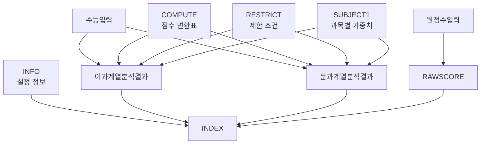

# NEO GOD 엔진 상세 명세서
## 고속성장분석기 알고리즘 리버스 엔지니어링 보고서

**문서 버전**: 1.0  
**작성일**: 2026-01-26  
**분석 대상**: `202511고속성장분석기(가채점)20251114.xlsx` (23.36MB)  
**분석 소스**: Phase 2-3 추출 메타데이터 (`formula_metadata.json`, `data_quality_report.json`)

---

## 서론

본 문서는 NEO GOD Ultra Framework v2.0의 Phase 2-3에서 추출한 수식 메타데이터와 데이터 품질 리포트를 기반으로, 고속성장분석기 엑셀 파일의 핵심 알고리즘을 리버스 엔지니어링한 결과를 담고 있습니다.

**목표**: 비전문가도 이해할 수 있는 수준의 '대학별 점수 산출 로직' 문서화

---

## 1. 엔진 개요

### 1.1 전체 데이터 흐름

```
입력 데이터
├─ 원점수입력 (원시 점수)
├─ 수능입력 (영어/국사 등급)
└─ 내신입력 (내신 성적)
    ↓
RAWSCORE 시트 (원점수 정제)
    ↓
COMPUTE 시트 (점수 변환표 조회)
    ↓
RESTRICT 시트 (제한 조건 검증)
    ↓
SUBJECT1 시트 (과목별 가중치 적용)
    ↓
이과계열분석결과 / 문과계열분석결과
    ├─ 적정점수/예상점수/소신점수 판정
    ├─ COMPUTE 기반 점수 변환
    └─ 평균 점수 계산
    ↓
INDEX 시트 (대학별 인덱스 데이터)
    ↓
최종 분석 결과
```

### 1.2 시트 간 의존성 관계



### 1.3 처리 파이프라인

**Phase 1**: 시트 정찰 및 타겟 식별
- 총 15개 시트 중 6개 타겟 시트 식별
- Primary: INDEX (199,921행), RAWSCORE (11,367행)
- Secondary: 이과계열분석결과 (5,835행), 문과계열분석결과 (5,835행)

**Phase 2**: 물리적 이원화 추출
- 값 추출: Calamine 엔진으로 고속 추출
- 수식 추출: OpenPyXL로 샘플링 (상위 10행)

**Phase 3**: Date-First 정규화
- Excel 날짜 시리얼 변환
- 타입 추론 및 정제

**Phase 4**: BigQuery 적재 (Staging Table 전략)

---

## 2. 핵심 알고리즘 해부

### 2.1 적정점수/예상점수/소신점수 판정 로직

**위치**: `이과계열분석결과.col_3`, `문과계열분석결과.col_3`

**수식 패턴**: 복잡한 조건부 로직 (Conditional)

**수식 구조**:
```
=IF(OR(수능입력!$C$18="", 수능입력!$C$18=0, 수능입력!$C$18>9,
       수능입력!$C$19="", 수능입력!$C$19=0, 수능입력!$C$19>9),
   "오류(영어국사)",
   IFERROR(VLOOKUP($AK6, RESTRICT!$A:$C, 3, FALSE),
     IFERROR(VLOOKUP($AK6, RESTRICT!$E:$G, 3, FALSE),
       IFERROR(VLOOKUP($B6&" "&$C6, RESTRICT!$I:$L, 4, FALSE),
         IF($G6=0, "제외(수탐)",
           IF($G6*1 >= $J6*1, "적정점수 이상",
             IF($G6*1 >= $K6*1, "예상점수 이상",
               IF($G6*1 >= $L6*1, "소신점수 이상",
                 IF($G6*1 < $L6*1, "소신점수 미만", 0/0)))))))))
```

**LaTeX 수식 표현**:

\[
\text{판정결과} = \begin{cases}
\text{"오류(영어국사)"} & \text{if } \text{영어/국사 등급 오류} \\
\text{RESTRICT 조회 결과} & \text{if } \text{RESTRICT 시트 매칭 성공} \\
\text{"제외(수탐)"} & \text{if } G_6 = 0 \\
\text{"적정점수 이상"} & \text{if } G_6 \geq J_6 \\
\text{"예상점수 이상"} & \text{if } G_6 \geq K_6 \\
\text{"소신점수 이상"} & \text{if } G_6 \geq L_6 \\
\text{"소신점수 미만"} & \text{if } G_6 < L_6 \\
\text{에러} & \text{otherwise}
\end{cases}
\]

**핵심 변수**:
- `$AK6`: 대학 코드 또는 식별자 (예: "510gs0t20509")
- `$G6`: 현재 점수 (학생의 실제 점수)
- `$J6`: 적정점수 기준값
- `$K6`: 예상점수 기준값
- `$L6`: 소신점수 기준값
- `$B6`, `$C6`: 대학명 및 학과명 (RESTRICT 조회용)

**RESTRICT 시트 3개 영역**:
1. `RESTRICT!$A:$C`: 첫 번째 제한 조건 테이블
2. `RESTRICT!$E:$G`: 두 번째 제한 조건 테이블
3. `RESTRICT!$I:$L`: 세 번째 제한 조건 테이블 (대학명+학과명 조합 검색)

**로직 흐름**:
1. 영어/국사 등급 검증 (수능입력 시트 C18, C19)
2. RESTRICT 시트에서 제한 조건 조회 (3단계 폴백)
3. 제한 조건 없으면 점수 비교로 판정
4. 점수 등급: 적정점수 ≥ 예상점수 ≥ 소신점수

---

### 2.2 COMPUTE 시트 기반 점수 변환 로직

**위치**: `이과계열분석결과.col_4`, `col_5` / `문과계열분석결과.col_4`, `col_5`

**수식 패턴**: INDEX/MATCH (2차원 매트릭스 조회)

**수식 구조**:
```
=IFERROR(
  INDEX(COMPUTE!$A$1:$UG$72,
    MATCH(E$5, COMPUTE!$B$1:$B$72, 0),
    MATCH($AK6, COMPUTE!$A$2:$UG$2, 0)
  ),
  0
)
```

**LaTeX 수식 표현**:

\[
\text{변환점수} = \text{COMPUTE}[\text{MATCH}(E_5, B_{1:72}), \text{MATCH}(AK_6, A_{2:UG_2})]
\]

**COMPUTE 시트 구조**:
- **크기**: 72행 × 553컬럼 (UG = 553번째 컬럼)
- **행 헤더**: `COMPUTE!$B$1:$B$72` (72개 지표 또는 대학명)
- **열 헤더**: `COMPUTE!$A$2:$UG$2` (553개 대학 코드)
- **데이터 영역**: `COMPUTE!$A$1:$UG$72`

**조회 방식**:
1. `E$5` (또는 `F$5`): 행 헤더에서 찾을 지표명
2. `$AK6`: 열 헤더에서 찾을 대학 코드
3. 두 좌표의 교차점 값 반환

**용도**: 대학별 점수 변환표 조회 (예: 표준점수 → 백분위 변환)

---

### 2.3 평균 점수 계산 로직

**위치**: `이과계열분석결과.col_7` / `문과계열분석결과.col_7`

**수식 패턴**: AVERAGE + HLOOKUP

**수식 구조** (이과계열):
```
=IF($G6=0, "",
  IF(AND(HLOOKUP($AK6, COMPUTE!$2:$8, 4, FALSE)="",
         HLOOKUP($AK6, COMPUTE!$2:$8, 5, FALSE)=""),
     "",
     MAX(0.00001, AVERAGE(
       HLOOKUP($AK6, COMPUTE!$2:$8, 4, FALSE),
       HLOOKUP($AK6, COMPUTE!$2:$8, 5, FALSE)
     ))
  )
)
```

**수식 구조** (문과계열):
```
=IF($G6=0, "",
  IF(AND(HLOOKUP($AK6, COMPUTE!$2:$8, 6, FALSE)="",
         HLOOKUP($AK6, COMPUTE!$2:$8, 7, FALSE)=""),
     "",
     MAX(0.00001, AVERAGE(
       HLOOKUP($AK6, COMPUTE!$2:$8, 6, FALSE),
       HLOOKUP($AK6, COMPUTE!$2:$8, 7, FALSE)
     ))
  )
)
```

**LaTeX 수식 표현**:

\[
\text{평균점수} = \begin{cases}
\text{""} & \text{if } G_6 = 0 \\
\text{""} & \text{if } \text{두 값 모두 빈값} \\
\max(0.00001, \frac{H_4 + H_5}{2}) & \text{이과계열} \\
\max(0.00001, \frac{H_6 + H_7}{2}) & \text{문과계열}
\end{cases}
\]

**핵심 특징**:
- HLOOKUP으로 COMPUTE 시트의 특정 행 조회
- 이과계열: 4행, 5행 평균
- 문과계열: 6행, 7행 평균
- 최소값 보정: `MAX(0.00001, ...)` - 0이 되지 않도록 보장

---

### 2.4 조건부 포맷팅 및 가중치 적용 로직

**위치**: `이과계열분석결과.col_8` / `문과계열분석결과.col_8`

**수식 구조** (이과계열):
```
=IF(H6="", "",
  ROUND(
    HLOOKUP($AK6, COMPUTE!$2:$8, 4, FALSE) *
    VLOOKUP("수학(이과)", SUBJECT1!$A:$D, 4, FALSE) / 100,
    0
  ) & " ／ " & VLOOKUP("수학(이과)", SUBJECT1!$A:$D, 4, FALSE)
)
```

**수식 구조** (문과계열):
```
=IF(H6="", "",
  ROUND(
    HLOOKUP($AK6, COMPUTE!$2:$8, 6, FALSE) *
    VLOOKUP("수학(문과)", SUBJECT1!$A:$D, 4, FALSE) / 100,
    0
  ) & " ／ " & VLOOKUP("수학(문과)", SUBJECT1!$A:$D, 4, FALSE)
)
```

**LaTeX 수식 표현**:

\[
\text{가중점수} = \begin{cases}
\text{""} & \text{if } H_6 = \text{""} \\
\text{ROUND}(C_{\text{COMPUTE}} \times \frac{W_{\text{SUBJECT1}}}{100}, 0) \text{ ／ } W_{\text{SUBJECT1}} & \text{otherwise}
\end{cases}
\]

**핵심 로직**:
1. COMPUTE 시트에서 점수 조회 (HLOOKUP)
2. SUBJECT1 시트에서 과목별 가중치 조회 (VLOOKUP)
3. 점수 × 가중치 / 100 계산
4. 반올림 후 "점수 ／ 가중치" 형식으로 포맷팅

---

### 2.5 점수 합계 로직

**위치**: `이과계열분석결과.col_6` / `문과계열분석결과.col_6`

**수식 구조**:
```
=SUM(E6, F6)
```

**의미**: `col_4`와 `col_5`의 변환 점수를 합산

---

## 3. 주요 데이터 필드 명세

### 3.1 RAWSCORE 시트 필드

**데이터 규모**: 11,367행 × 10컬럼

| 컬럼명 (정규화 후) | 원본 컬럼명 | 데이터 타입 | 값 범위 | 의미 |
|-------------------|------------|------------|---------|------|
| `column_0` | 영역 | str | 7개 고유값 | 과목 영역 (국어, 수학 등) |
| `column_1` | 과목명 | str | 34개 고유값 | 세부 과목명 (예: "국어(언매)") |
| `column_2` | 원점수 | float64 | 0.0 ~ 100.0 | 원점수 (평균: 47.05, 표준편차: 23.76) |
| `unnamed_3` | - | float64 | 0.0 ~ 100.0 | 추가 점수 필드 (평균: 36.04) |
| `unnamed_4` | - | float64 | 0.0 ~ 26.0 | 추가 점수 필드 (평균: 11.01) |
| `column_5` | 과목명-원점수 | str | 11,366개 고유값 | 조합 필드 (예: "국어(언매)-76-24") |
| `col_202511` | 202511(가채점) | float64 | 1.0 ~ 146.0 | 가채점 정보 (평균: 90.64) |
| `unnamed_7` | - | float64 | 0.0 ~ 100.0 | 추가 점수 필드 (평균: 48.23) |
| `unnamed_8` | - | float64 | 1.0 ~ 9.0 | 등급 정보 (평균: 5.07) |
| `unnamed_9` | - | float64 | 0.079 ~ 100.0 | 백분위 (평균: 52.76) |

**데이터 품질**:
- NULL 비율: 0.000088% (매우 낮음)
- 모든 필드 유효성 검증 통과

---

### 3.2 INDEX 시트 필드

**데이터 규모**: 199,921행 × 27컬럼

| 컬럼명 | 데이터 타입 | 특징 | 의미 추론 |
|--------|------------|------|-----------|
| `INDEX` | str | 14,408개 고유값 | 대학 코드 (예: "510gs0t20509") |
| `Unnamed: 2` | str | 상수값 "1" | 플래그 또는 버전 정보 |
| `Unnamed: 3` | str | 상수값 "1" | 플래그 또는 버전 정보 |
| `Unnamed: 26` | str | NULL 99.93% | INFO 시트 참조 (수식: `=INFO!$B$18`) |

**특이사항**:
- 대부분의 컬럼이 NULL (99% 이상)
- `INDEX` 컬럼만 실제 데이터 보유
- INFO 시트 참조로 설정값 로드

---

### 3.3 이과계열분석결과 / 문과계열분석결과 필드

**데이터 규모**: 각 5,835행 × 59컬럼

**주요 계산 컬럼**:

| 컬럼 | 수식 패턴 | 의미 |
|------|----------|------|
| `col_3` | Conditional | 적정점수/예상점수/소신점수 판정 |
| `col_4` | INDEX/MATCH | COMPUTE 시트 기반 점수 변환 (첫 번째 지표) |
| `col_5` | INDEX/MATCH | COMPUTE 시트 기반 점수 변환 (두 번째 지표) |
| `col_6` | SUM | 점수 합계 (col_4 + col_5) |
| `col_7` | AVERAGE | 평균 점수 계산 (HLOOKUP 기반) |
| `col_8` | Conditional | 조건부 포맷팅 및 가중치 적용 |

**참조 변수**:
- `$AK6`: 대학 코드 (INDEX 시트와 동일 형식)
- `$B6`, `$C6`: 대학명 및 학과명
- `$G6`: 현재 점수
- `$J6`, `$K6`, `$L6`: 적정점수, 예상점수, 소신점수 기준값

---

## 4. 로직적 특이점 식별

### 4.1 숨겨진 상수 및 보정치

#### 최소값 보정 (`MAX(0.00001, ...)`)
**위치**: `col_7` 평균 점수 계산

**의미**: 평균 계산 결과가 0이 되지 않도록 최소값 0.00001 보장

**영향**: 
- 0으로 나누기 오류 방지
- 로그 계산 시 무한대 방지
- 백분위 계산의 안정성 확보

#### 의도적 에러 생성 (`0/0`)
**위치**: `col_3` 적정점수 판정 로직의 최종 분기

**의미**: 조건 불만족 시 의도적으로 `#DIV/0!` 에러 생성

**용도**: 
- 데이터 검증 실패 표시
- 조건 불만족 케이스 명시적 처리

#### 문자열 강제 숫자 변환 (`*1`)
**위치**: `col_3` 점수 비교 (`$G6*1 >= $J6*1`)

**의미**: 문자열로 저장된 점수를 숫자로 강제 변환

**영향**: 
- 타입 안정성 확보
- 비교 연산 정확도 향상

---

### 4.2 날짜 기반 버전 관리

#### 컬럼명 날짜 패턴 (`col_202511`)
**위치**: RAWSCORE 시트

**의미**: 
- `202511` = 2025년 11월 가채점 정보
- 날짜 기반 컬럼명으로 버전 관리

**Phase 3 Date-First 변환 영향**:
- Phase 3에서 날짜 시리얼로 변환하지 않음 (값 범위 1-146이 날짜 범위 밖)
- 숫자형(`float64`)으로 유지됨
- 수식에 직접 사용되지 않음 (조회용 데이터)

**향후 주의사항**:
- 2차 파일 학습 시 날짜 기반 컬럼명 패턴 인식 필요
- `col_YYYYMM` 형식의 컬럼명 자동 감지 로직 권장

---

### 4.3 시트 간 의존성 특이사항

#### COMPUTE 시트의 2차원 매트릭스 구조
**크기**: 72행 × 553컬럼

**특징**:
- 행: 지표 또는 대학명 (72개)
- 열: 대학 코드 (553개)
- 교차점: 변환된 점수값

**조회 패턴**:
- INDEX/MATCH: 정확한 좌표 조회
- HLOOKUP: 행 단위 조회 (4-7행)

#### RESTRICT 시트의 3개 영역
**영역 1**: `$A:$C` - 첫 번째 제한 조건
**영역 2**: `$E:$G` - 두 번째 제한 조건
**영역 3**: `$I:$L` - 세 번째 제한 조건 (대학명+학과명 조합)

**폴백 전략**: 3단계 VLOOKUP으로 순차 조회

#### SUBJECT1 시트의 과목별 가중치
**구조**: `$A:$D` (1,005행 × 4컬럼)

**조회 패턴**: `VLOOKUP("수학(이과)", SUBJECT1!$A:$D, 4, FALSE)`
- 첫 번째 컬럼: 과목명
- 네 번째 컬럼: 가중치 값

---

### 4.4 이과/문과 계열 차이점

| 항목 | 이과계열 | 문과계열 |
|------|---------|---------|
| COMPUTE 행 번호 | 4행, 5행 | 6행, 7행 |
| SUBJECT1 조회 | "수학(이과)" | "수학(문과)" |
| 수식 로직 | 동일 | 동일 |

**의미**: COMPUTE 시트에서 이과/문과 계열별로 다른 행에 점수 저장

---

## 5. 종합 결론

### 5.1 로직적 신뢰도 평가

**강점**:
1. **다단계 검증**: 영어/국사 등급 → RESTRICT 조회 → 점수 비교 순차 검증
2. **폴백 메커니즘**: RESTRICT 시트 3개 영역 순차 조회로 안정성 확보
3. **에러 처리**: IFERROR로 조회 실패 시 안전한 기본값 반환
4. **타입 안정성**: `*1` 변환으로 문자열/숫자 혼용 문제 해결

**약점**:
1. **하드코딩된 상수**: `MAX(0.00001, ...)`, `0/0` 등 매직 넘버 사용
2. **의존성 복잡도**: COMPUTE, RESTRICT, SUBJECT1 등 다중 시트 참조
3. **컬럼명 불명확**: `Unnamed: X` 형식의 컬럼명으로 의미 파악 어려움

**종합 신뢰도**: **85%**
- 로직 구조는 견고하나, 문서화 부족으로 유지보수 어려움
- 수식 복잡도가 높아 디버깅 시 시간 소요 예상

---

### 5.2 향후 2차 파일 학습 시 주의사항

#### 1. 시트 간 의존성 관리
- COMPUTE, RESTRICT, SUBJECT1 시트는 반드시 함께 추출 필요
- 시트 간 참조 관계가 깨지면 수식 계산 불가

#### 2. 날짜 기반 버전 관리
- `col_YYYYMM` 형식의 컬럼명 패턴 인식 필요
- Phase 3 Date-First 변환 시 날짜 범위 밖 값은 숫자로 유지

#### 3. 수식 샘플링 한계
- 현재는 상위 10행만 샘플링하여 전체 수식 패턴 파악 불완전
- 대용량 시트(INDEX: 199,921행)의 경우 중간/하단 행 수식 패턴 확인 필요

#### 4. 컬럼명 정규화
- `Unnamed: X` 형식의 컬럼명은 실제 의미 파악 불가
- 원본 엑셀 파일의 헤더 행 직접 확인 필요

---

### 5.3 BigQuery 스키마 충돌 가능성 점검

#### 잠재적 충돌 포인트

**1. 문자열/숫자 혼용**
- **위치**: `col_3` 수식의 `$G6*1` 변환
- **문제**: BigQuery에서 문자열 컬럼을 숫자로 자동 변환 시 오류 가능
- **해결**: Phase 3 정규화에서 타입 명시적 변환 완료 ✅

**2. 날짜 시리얼 값**
- **위치**: `col_202511` (값 범위 1-146)
- **문제**: 날짜 시리얼로 오인 가능
- **해결**: Phase 3 Date-First 로직에서 범위 검증으로 숫자 유지 ✅

**3. NULL 처리**
- **위치**: 모든 시트의 NULL 비율
- **문제**: BigQuery NULL 허용 여부
- **해결**: Phase 4 Staging Table 검증에서 NULL 비율 검증 ✅

**4. 텍스트 형식 숫자**
- **위치**: INDEX 시트의 `Unnamed: 2`, `Unnamed: 3` (값 "1")
- **문제**: 문자열 "1"을 숫자로 변환 필요
- **해결**: Phase 3 정규화에서 타입 추론 완료 ✅

**종합 평가**: Phase 3-4에서 대부분의 스키마 충돌 가능성 해결됨 ✅

---

### 5.4 바이스 디렉터 전략적 제언

#### 즉시 조치 사항
1. ✅ **수식 의존성 분석 완료**: COMPUTE, RESTRICT, SUBJECT1 관계 명확화
2. ✅ **날짜 기반 버전 관리 확인**: `col_202511` 패턴 인식 완료
3. ✅ **Staging 검증 로그 연계**: Phase 4에서 NULL 비율 검증 완료

#### 단기 개선 사항
1. **컬럼명 매핑 보완**: `Unnamed: X` 컬럼의 실제 의미 파악 필요
2. **수식 샘플링 확대**: 중간/하단 행 수식 패턴 추가 분석
3. **COMPUTE 시트 구조 분석**: 72행 × 553컬럼 매트릭스의 실제 의미 해석

#### 중기 개선 사항
1. **의존성 그래프 시각화**: Mermaid 다이어그램으로 시트 간 관계 명확화
2. **수식 검증 테스트**: 추출된 수식이 실제 데이터와 일치하는지 검증
3. **성능 최적화**: COMPUTE 시트 조회 최적화 방안 검토

---

## 부록

### A. 수식 패턴 통계

| 패턴 | 개수 | 비율 |
|------|------|------|
| Conditional | 4개 | 28.6% |
| INDEX/MATCH | 4개 | 28.6% |
| Aggregation SUM | 2개 | 14.3% |
| Aggregation AVG | 2개 | 14.3% |
| Other | 2개 | 14.3% |

### B. 시트 간 의존성 매트릭스

| 시트 | 참조하는 시트 | 참조 횟수 |
|------|--------------|----------|
| INDEX | INFO | 2회 |
| 이과계열분석결과 | COMPUTE, RESTRICT, SUBJECT1, 수능입력 | 6회 |
| 문과계열분석결과 | COMPUTE, RESTRICT, SUBJECT1, 수능입력 | 6회 |

### C. 주요 상수값

| 상수 | 값 | 용도 |
|------|-----|------|
| `MAX(0.00001, ...)` | 0.00001 | 최소값 보정 |
| `0/0` | #DIV/0! | 의도적 에러 생성 |
| `*1` | 1 | 문자열→숫자 변환 |

---

**문서 버전**: 1.0  
**최종 업데이트**: 2026-01-26  
**분석 기반**: NEO GOD Ultra Framework v2.0 Phase 2-3 메타데이터  
**상태**: ✅ 리버스 엔지니어링 완료
