# NeoPrime 플로우차트 & 사이트맵 (Mermaid)

**Version**: 1.0  
**Date**: 2026-01-21  

---

## 플로우차트 범례 (Legend)

| 도형 | Mermaid 문법 | 의미 | 색상 |
|:----:|:-------------|:-----|:-----|
| ⭕ 원/스타디움 | `([텍스트])` | 시작/종료 | 🟢 녹색 |
| ◇ 마름모 | `{텍스트}` | 조건/분기 | 🟡 노란색 |
| ▱ 평행사변형 | `[/텍스트/]` | 입력 | 🔵 파란색 |
| ▱ 역평행사변형 | `[\텍스트\]` | 출력 | 🟣 보라색 |
| □ 사각형 | `[텍스트]` | 처리/프로세스 | ⬜ 기본 |
| ◯ 이중원 | `(((텍스트)))` | 연결점 | ⚪ 흰색 |
| **Best Case** | - | 최적 경로 | 🟢 **굵은 녹색선** |

---

## 1. 사이트맵 구조도

### 1.1 웹 대시보드 사이트맵

```mermaid
flowchart TB
    %% 스타일 정의
    classDef root fill:#1a365d,stroke:#2c5282,stroke-width:3px,color:#fff,font-weight:bold
    classDef level1 fill:#2b6cb0,stroke:#2c5282,stroke-width:2px,color:#fff
    classDef level2 fill:#4299e1,stroke:#3182ce,stroke-width:1px,color:#fff
    classDef level3 fill:#90cdf4,stroke:#63b3ed,stroke-width:1px,color:#1a365d
    classDef highlight fill:#48bb78,stroke:#38a169,stroke-width:3px,color:#fff,font-weight:bold

    %% 루트
    ROOT(["🖥️ NeoPrime<br/>웹 대시보드"]):::root

    %% Level 1 메인 메뉴
    ROOT --> DASH["📊 대시보드 홈<br/>/"]:::level1
    ROOT --> STU["👥 학생 관리<br/>/students"]:::level1
    ROOT --> EVAL["📝 평가 관리<br/>/evaluations"]:::level1
    ROOT --> ANA["📈 분석 & 리포트<br/>/analytics"]:::level1
    ROOT --> SET["⚙️ 설정<br/>/settings"]:::level1

    %% 대시보드 홈 서브
    DASH --> DASH1["학원 현황"]:::level2
    DASH --> DASH2["주간 통계"]:::level2
    DASH --> DASH3["예상 합격"]:::level2

    %% 학생 관리 서브
    STU --> STU1["📋 학생 리스트<br/>/students/list"]:::level2
    STU --> STU2["👤 학생 상세<br/>/students/:id"]:::highlight
    STU --> STU3["➕ 학생 추가<br/>/students/new"]:::level2

    %% 학생 상세 서브
    STU2 --> STU2A["기본 정보"]:::level3
    STU2 --> STU2B["성장 곡선"]:::level3
    STU2 --> STU2C["평가 이력"]:::level3
    STU2 --> STU2D["합격 예측"]:::level3

    %% 평가 관리 서브
    EVAL --> EVAL1["✏️ 평가 입력<br/>/evaluations/new"]:::highlight
    EVAL --> EVAL2["📜 평가 이력<br/>/evaluations/history"]:::level2
    EVAL --> EVAL3["🤖 AI 피드백<br/>/evaluations/ai-feedback"]:::level2

    %% 분석 & 리포트 서브
    ANA --> ANA1["🎯 합격 예측<br/>/analytics/admission"]:::highlight
    ANA --> ANA2["📈 성장 분석<br/>/analytics/growth"]:::level2
    ANA --> ANA3["👨‍🏫 강사 편차<br/>/analytics/teacher-bias"]:::level2
    ANA --> ANA4["📄 리포트<br/>/analytics/reports"]:::level2

    %% 설정 서브
    SET --> SET1["🔐 계정 설정<br/>/settings/account"]:::level2
    SET --> SET2["🏢 학원 정보<br/>/settings/academy"]:::level2
    SET --> SET3["👥 강사 관리<br/>/settings/teachers"]:::level2
```

### 1.2 모바일 앱 사이트맵

```mermaid
flowchart TB
    %% 스타일 정의
    classDef root fill:#553c9a,stroke:#6b46c1,stroke-width:3px,color:#fff,font-weight:bold
    classDef level1 fill:#805ad5,stroke:#6b46c1,stroke-width:2px,color:#fff
    classDef level2 fill:#9f7aea,stroke:#805ad5,stroke-width:1px,color:#fff
    classDef level3 fill:#d6bcfa,stroke:#b794f4,stroke-width:1px,color:#553c9a
    classDef highlight fill:#48bb78,stroke:#38a169,stroke-width:3px,color:#fff,font-weight:bold

    %% 루트
    ROOT(["📱 NeoPrime<br/>모바일 앱"]):::root

    %% Level 1 하단 탭바
    ROOT --> HOME["🏠 홈<br/>/"]:::level1
    ROOT --> PERF["📈 성과<br/>/performance"]:::level1
    ROOT --> ADM["🎯 합격 진단<br/>/admission"]:::highlight
    ROOT --> SUCC["⭐ 성공 사례<br/>/success-stories"]:::level1
    ROOT --> PROF["👤 내 정보<br/>/profile"]:::level1

    %% 홈 서브
    HOME --> HOME1["주간 성과 카드"]:::level2
    HOME --> HOME2["합격 가능성 요약"]:::level2
    HOME --> HOME3["액션 제안"]:::level2

    %% 성과 서브
    PERF --> PERF1["📊 주간 리포트<br/>/performance/weekly"]:::highlight
    PERF --> PERF2["📈 성장 그래프<br/>/performance/growth"]:::level2
    PERF --> PERF3["💬 피드백 이력<br/>/performance/feedback"]:::level2

    %% 합격 진단 서브
    ADM --> ADM1["🎓 목표 대학<br/>/admission/targets"]:::level2
    ADM --> ADM2["📊 합격 확률<br/>/admission/probability"]:::highlight
    ADM --> ADM3["👥 유사 사례<br/>/admission/similar-cases"]:::level2

    %% 성공 사례 서브
    SUCC --> SUCC1["선배 스토리"]:::level2
    SUCC --> SUCC2["질문하기"]:::level2

    %% 내 정보 서브
    PROF --> PROF1["프로필 수정"]:::level2
    PROF --> PROF2["알림 설정"]:::level2
    PROF --> PROF3["로그아웃"]:::level2
```

---

## 2. 전체 서비스 플로우

### 2.1 NeoPrime 전체 시스템 플로우

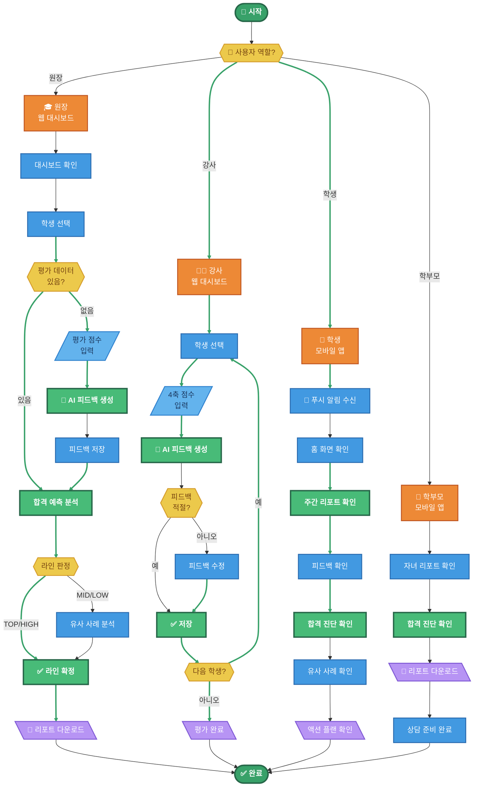

---

## 3. 기능별 상세 플로우차트

### 3.1 FLOW-01: 원장의 라인 잡기 (핵심 시나리오)

```mermaid
flowchart TB
    %% 스타일 정의
    classDef startEnd fill:#38a169,stroke:#276749,stroke-width:3px,color:#fff,font-weight:bold
    classDef process fill:#4299e1,stroke:#2b6cb0,stroke-width:2px,color:#fff
    classDef decision fill:#ecc94b,stroke:#d69e2e,stroke-width:2px,color:#744210,font-weight:bold
    classDef input fill:#63b3ed,stroke:#3182ce,stroke-width:2px,color:#1a365d
    classDef output fill:#b794f4,stroke:#805ad5,stroke-width:2px,color:#fff
    classDef best fill:#48bb78,stroke:#276749,stroke-width:3px,color:#fff,font-weight:bold
    classDef warning fill:#fc8181,stroke:#c53030,stroke-width:2px,color:#fff

    %% 시작
    START(["🚀 시작<br/>라인 잡기"]):::startEnd

    %% 메인 플로우
    START --> A1["웹 대시보드 접속"]:::process
    A1 --> A2["학생 리스트 페이지"]:::process
    A2 --> A3[/"학생 선택<br/>(클릭)"/]:::input
    A3 --> A4["학생 상세 페이지"]:::process

    %% 분기 1: 평가 데이터 확인
    A4 --> D1{{"📊 평가 데이터<br/>존재?"}}:::decision

    %% NO 분기: 평가 입력
    D1 -->|"❌ 없음"| B1["평가 입력 페이지 이동"]:::process
    B1 --> B2[/"🎨 4축 점수 입력<br/>구도/톤/발상/완성도"/]:::input
    B2 --> B3[/"📝 작품 상태<br/>텍스트 입력"/]:::input
    B3 --> B4["🤖 AI 피드백 생성<br/>버튼 클릭"]:::best
    B4 --> B5["⏳ 로딩 (2-3초)"]:::process
    B5 --> B6["피드백 결과 표시"]:::process

    %% 분기 2: 피드백 검토
    B6 --> D2{{"✅ 피드백<br/>적절?"}}:::decision
    D2 -->|"❌ 아니오"| B7["피드백 직접 수정"]:::process
    B7 --> B8
    D2 -->|"✅ 예"| B8["💾 저장"]:::best

    %% YES 분기: 합격 예측
    D1 -->|"✅ 있음"| C1
    B8 --> C1

    C1["🎯 합격 예측 분석 실행"]:::best
    C1 --> C2["합격 확률 결과 확인"]:::process

    %% 분기 3: 합격 확률 판정
    C2 --> D3{{"📈 합격 확률<br/>수준?"}}:::decision

    %% HIGH/TOP: 바로 라인 확정
    D3 -->|"🟢 HIGH/TOP"| E1["✅ 대학별 라인 확정"]:::best

    %% MID/LOW: 유사 사례 확인
    D3 -->|"🟡 MID/LOW"| F1["유사 사례 확인"]:::process
    F1 --> F2["과거 유사 프로필<br/>학생 결과 확인"]:::process

    %% 분기 4: 성장 가능성
    F2 --> D4{{"📈 성장<br/>가능성?"}}:::decision
    D4 -->|"✅ 예"| F3["성장 시나리오 분석"]:::process
    F3 --> F4["목표 대학 도달<br/>가능성 확인"]:::process
    F4 --> E1
    D4 -->|"❌ 아니오"| F5["⚠️ 현실적 라인 조정"]:::warning
    F5 --> E1

    %% 최종 단계
    E1 --> G1["라인 확정 완료<br/>(TOP/HIGH/MID/LOW)"]:::best
    G1 --> G2[\"📄 리포트<br/>PDF 다운로드"\]:::output

    %% 종료
    G2 --> ENDOK(["✅ 완료<br/>상담 준비 완료"]):::startEnd

    %% Best Case 경로 강조
    linkStyle 0,1,2,3,4,9,10,11,12,13,14,15,16,17,22,23,24 stroke:#38a169,stroke-width:3px
```

### 3.2 FLOW-02: 강사의 주간 평가 입력

```mermaid
flowchart TB
    %% 스타일 정의
    classDef startEnd fill:#38a169,stroke:#276749,stroke-width:3px,color:#fff,font-weight:bold
    classDef process fill:#4299e1,stroke:#2b6cb0,stroke-width:2px,color:#fff
    classDef decision fill:#ecc94b,stroke:#d69e2e,stroke-width:2px,color:#744210,font-weight:bold
    classDef input fill:#63b3ed,stroke:#3182ce,stroke-width:2px,color:#1a365d
    classDef output fill:#b794f4,stroke:#805ad5,stroke-width:2px,color:#fff
    classDef best fill:#48bb78,stroke:#276749,stroke-width:3px,color:#fff,font-weight:bold
    classDef loop fill:#ed8936,stroke:#c05621,stroke-width:2px,color:#fff

    %% 시작
    START(["🚀 시작<br/>주간 평가"]):::startEnd

    %% 메인 플로우
    START --> A1["웹 대시보드 접속"]:::process
    A1 --> A2["평가 관리 메뉴 선택"]:::process
    A2 --> A3["주간 평가 입력 페이지"]:::process

    %% 루프 시작
    A3 --> LOOP((("🔄 학생별<br/>반복"))):::loop

    LOOP --> B1[/"👤 학생 선택<br/>(드롭다운)"/]:::input
    B1 --> B2[/"🎨 구도 점수<br/>(0-10)"/]:::input
    B2 --> B3[/"🎨 톤/명암 점수<br/>(0-10)"/]:::input
    B3 --> B4[/"🎨 발상/컨셉 점수<br/>(0-10)"/]:::input
    B4 --> B5[/"🎨 완성도/태도 점수<br/>(0-10)"/]:::input
    B5 --> B6[/"📝 작품 상태<br/>텍스트 입력"/]:::input

    %% AI 피드백 생성
    B6 --> C1["🤖 AI 피드백 생성<br/>버튼 클릭"]:::best
    C1 --> C2["⏳ 로딩 (2-3초)"]:::process
    C2 --> C3["피드백 결과 표시<br/>━━━━━━━━━━━━━<br/>1️⃣ 잘된 점<br/>2️⃣ 핵심 문제<br/>3️⃣ 다음 1주 액션"]:::process

    %% 분기: 피드백 적절?
    C3 --> D1{{"✅ 피드백<br/>적절?"}}:::decision
    D1 -->|"✅ 예"| E1["💾 저장"]:::best
    D1 -->|"❌ 아니오"| D2["✏️ 피드백 직접 수정"]:::process
    D2 --> E1

    %% 분기: 다음 학생?
    E1 --> D3{{"👥 모든 학생<br/>완료?"}}:::decision
    D3 -->|"❌ 아니오"| LOOP
    D3 -->|"✅ 예"| F1[\"✅ 주간 평가 완료"\]:::output

    %% 종료
    F1 --> ENDOK(["✅ 완료<br/>평가 완료"]):::startEnd

    %% Best Case 경로 강조
    linkStyle 0,1,2,3,4,5,6,7,8,9,10,11,12,13,14,16,18 stroke:#38a169,stroke-width:3px
```

### 3.3 FLOW-03: 학생의 주간 성과 확인

```mermaid
flowchart TB
    %% 스타일 정의
    classDef startEnd fill:#38a169,stroke:#276749,stroke-width:3px,color:#fff,font-weight:bold
    classDef process fill:#4299e1,stroke:#2b6cb0,stroke-width:2px,color:#fff
    classDef decision fill:#ecc94b,stroke:#d69e2e,stroke-width:2px,color:#744210,font-weight:bold
    classDef input fill:#63b3ed,stroke:#3182ce,stroke-width:2px,color:#1a365d
    classDef output fill:#b794f4,stroke:#805ad5,stroke-width:2px,color:#fff
    classDef best fill:#48bb78,stroke:#276749,stroke-width:3px,color:#fff,font-weight:bold
    classDef notification fill:#ed8936,stroke:#c05621,stroke-width:2px,color:#fff

    %% 시작
    START(["🚀 시작"]):::startEnd

    %% 푸시 알림
    START --> A1["📲 푸시 알림 수신<br/>'이번 주 평가 결과!'"]:::notification
    A1 --> A2["📱 앱 실행"]:::process

    %% 홈 화면
    A2 --> B1["🏠 홈 화면"]:::process
    B1 --> B2["주간 성과 카드 확인<br/>━━━━━━━━━━━━━<br/>📊 평가: A-<br/>📈 지난주 대비 ↑"]:::best
    B2 --> B3["'자세히 보기' 클릭"]:::process

    %% 주간 리포트
    B3 --> C1["📊 주간 리포트 페이지"]:::best
    C1 --> C2["이번 주 평가 확인<br/>(A-)"]:::process
    C2 --> C3["성장 추이 확인<br/>(B+ → A-)"]:::process
    C3 --> C4["피드백 상세 확인"]:::process

    %% 분기: 피드백 이해?
    C4 --> D1{{"💭 피드백<br/>이해됨?"}}:::decision
    D1 -->|"❌ 아니오"| E1[/"❓ 질문 작성"/]:::input
    E1 --> E2["원장/강사에게 제출"]:::process
    E2 --> F1
    D1 -->|"✅ 예"| F1

    %% 합격 진단
    F1["🎯 합격 진단 탭 이동"]:::best
    F1 --> F2["합격 확률 확인<br/>━━━━━━━━━━━━━<br/>🎓 홍대: 82% ↑<br/>🎓 이대: 95% →<br/>🎓 경희: 98% →"]:::best
    F2 --> F3["유사 사례 확인"]:::process
    F3 --> F4["과거 선배 사례 확인"]:::process
    F4 --> F5["성공 패턴 학습"]:::process

    %% 액션 플랜
    F5 --> G1["💡 다음 1주 액션 확인<br/>━━━━━━━━━━━━━<br/>'구도 안정성에<br/>집중하세요'"]:::best

    %% 출력
    G1 --> G2[\"📋 액션 플랜<br/>저장/확인"\]:::output

    %% 종료
    G2 --> ENDOK(["✅ 완료<br/>동기부여 완료"]):::startEnd

    %% Best Case 경로 강조
    linkStyle 0,1,2,3,4,5,6,7,8,9,12,13,14,15,16,17,18,19 stroke:#38a169,stroke-width:3px
```

### 3.4 FLOW-04: 학부모의 상담 준비

```mermaid
flowchart TB
    %% 스타일 정의
    classDef startEnd fill:#38a169,stroke:#276749,stroke-width:3px,color:#fff,font-weight:bold
    classDef process fill:#4299e1,stroke:#2b6cb0,stroke-width:2px,color:#fff
    classDef decision fill:#ecc94b,stroke:#d69e2e,stroke-width:2px,color:#744210,font-weight:bold
    classDef input fill:#63b3ed,stroke:#3182ce,stroke-width:2px,color:#1a365d
    classDef output fill:#b794f4,stroke:#805ad5,stroke-width:2px,color:#fff
    classDef best fill:#48bb78,stroke:#276749,stroke-width:3px,color:#fff,font-weight:bold
    classDef warning fill:#fc8181,stroke:#c53030,stroke-width:2px,color:#fff

    %% 시작
    START(["🚀 시작<br/>상담 준비"]):::startEnd

    %% 앱 접속
    START --> A1["📱 앱 실행"]:::process
    A1 --> A2["🏠 홈 화면"]:::process

    %% 자녀 현황 확인
    A2 --> B1["👶 자녀 성과<br/>리포트 확인"]:::best
    B1 --> B2["📊 주간 평가 결과 확인"]:::process
    B2 --> B3["📈 성장 추이 확인"]:::process

    %% 리포트 다운로드
    B3 --> C1[\"📄 주간 리포트<br/>PDF 다운로드"\]:::output

    %% 합격 진단
    C1 --> D1["🎯 합격 진단<br/>페이지 이동"]:::best
    D1 --> D2["목표 대학별<br/>합격 확률 확인<br/>━━━━━━━━━━━━━<br/>🎓 홍대: 82%<br/>🎓 이대: 95%<br/>🎓 경희: 98%"]:::best
    D2 --> D3["⚠️ 리스크 분석 확인"]:::warning
    D3 --> D4["주의사항 확인"]:::process

    %% 유사 사례
    D4 --> E1["👥 유사 사례 확인"]:::process
    E1 --> E2["과거 합격 학생<br/>패턴 확인"]:::process
    E2 --> E3["성공 요인 분석"]:::process

    %% 리포트 다운로드
    E3 --> F1[\"📄 상담용 리포트<br/>PDF 다운로드"\]:::output

    %% 질문 준비
    F1 --> G1[/"📝 질문 리스트<br/>작성 (메모)"/]:::input
    G1 --> G2["상담 질문 정리"]:::process

    %% 종료
    G2 --> ENDOK(["✅ 완료<br/>상담 준비 완료"]):::startEnd

    %% Best Case 경로 강조
    linkStyle 0,1,2,3,4,5,6,7,8,9,10,11,12,13,14,15 stroke:#38a169,stroke-width:3px
```

### 3.5 FLOW-05: AI 피드백 생성 (핵심 기술 플로우)

```mermaid
flowchart TB
    %% 스타일 정의
    classDef startEnd fill:#38a169,stroke:#276749,stroke-width:3px,color:#fff,font-weight:bold
    classDef process fill:#4299e1,stroke:#2b6cb0,stroke-width:2px,color:#fff
    classDef decision fill:#ecc94b,stroke:#d69e2e,stroke-width:2px,color:#744210,font-weight:bold
    classDef input fill:#63b3ed,stroke:#3182ce,stroke-width:2px,color:#1a365d
    classDef output fill:#b794f4,stroke:#805ad5,stroke-width:2px,color:#fff
    classDef best fill:#48bb78,stroke:#276749,stroke-width:3px,color:#fff,font-weight:bold
    classDef ai fill:#ed8936,stroke:#c05621,stroke-width:2px,color:#fff
    classDef system fill:#718096,stroke:#4a5568,stroke-width:2px,color:#fff

    %% 시작
    START(["🚀 시작<br/>AI 피드백 생성"]):::startEnd

    %% 입력 단계
    START --> A1[/"👤 학생 정보 입력<br/>이름, 학년, 희망대학"/]:::input
    A1 --> A2[/"🎨 4축 평가 점수 입력<br/>구도/톤/발상/완성도"/]:::input
    A2 --> A3[/"📝 작품 상태 설명<br/>입력"/]:::input

    %% API 호출
    A3 --> B1["🤖 'AI 피드백 생성'<br/>버튼 클릭"]:::best
    B1 --> B2["📡 API 호출<br/>(Cloud Function)"]:::system

    %% 시스템 프롬프트 구성
    B2 --> C1["📋 시스템 프롬프트 구성"]:::ai
    C1 --> C2["━━━━━━━━━━━━━━━━━━━<br/>📌 역할 정의<br/>원장 '이은일' 스타일<br/>AI 코치<br/>━━━━━━━━━━━━━━━━━━━"]:::system
    C2 --> C3["━━━━━━━━━━━━━━━━━━━<br/>📌 구조 정의<br/>3단계: 잘된 점 →<br/>핵심 문제 → 액션<br/>━━━━━━━━━━━━━━━━━━━"]:::system
    C3 --> C4["━━━━━━━━━━━━━━━━━━━<br/>📌 톤 정의<br/>직설적이되 존중<br/>추상적 칭찬 금지<br/>━━━━━━━━━━━━━━━━━━━"]:::system
    C4 --> C5["━━━━━━━━━━━━━━━━━━━<br/>📌 Few-shot 예시<br/>예시 1, 2, 3...<br/>━━━━━━━━━━━━━━━━━━━"]:::system

    %% LLM 호출
    C5 --> D1["🧠 Vertex AI<br/>Gemini 호출"]:::ai
    D1 --> D2["⏳ 응답 대기<br/>(2-3초)"]:::process
    D2 --> D3["📥 응답 수신"]:::process

    %% 파싱 및 구조화
    D3 --> E1["🔄 피드백 파싱<br/>및 구조화"]:::process
    E1 --> E2["━━━━━━━━━━━━━━━━━━━<br/>1️⃣ 잘된 점<br/>'구도 감각 안정적...'<br/>━━━━━━━━━━━━━━━━━━━"]:::best
    E2 --> E3["━━━━━━━━━━━━━━━━━━━<br/>2️⃣ 핵심 문제<br/>'명암 대비 약함...'<br/>━━━━━━━━━━━━━━━━━━━"]:::process
    E3 --> E4["━━━━━━━━━━━━━━━━━━━<br/>3️⃣ 다음 1주 액션<br/>'명암 연습 집중...'<br/>━━━━━━━━━━━━━━━━━━━"]:::process

    %% 미리보기
    E4 --> F1["👀 피드백 미리보기<br/>표시"]:::process

    %% 분기: 수정 필요?
    F1 --> D_MOD{{"✏️ 수정<br/>필요?"}}:::decision
    D_MOD -->|"❌ 아니오"| G1
    D_MOD -->|"✅ 예"| F2["직접 수정"]:::process
    F2 --> G1

    %% 저장
    G1["💾 Firestore 저장<br/>(submissions 콜렉션)"]:::best
    G1 --> G2["📲 학생 앱<br/>푸시 알림 발송"]:::process

    %% 출력
    G2 --> H1[\"✅ 피드백 생성 완료"\]:::output

    %% 종료
    H1 --> ENDOK(["✅ 완료"]):::startEnd

    %% Best Case 경로 강조
    linkStyle 0,1,2,3,4,5,6,7,8,9,10,11,12,13,14,15,16,17,18,21,22,23 stroke:#38a169,stroke-width:3px
```

---

## 4. 합격 예측 엔진 플로우

### 4.1 Theory Engine + A/B 갭 보정 플로우

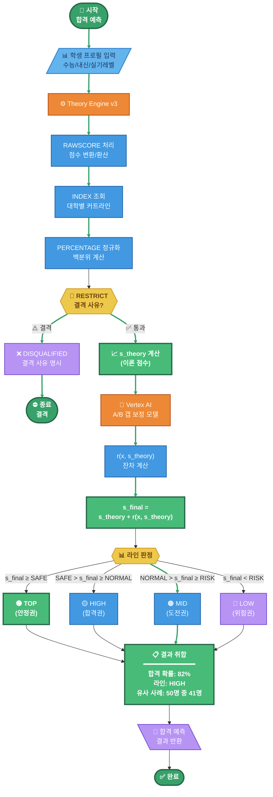

---

## 5. 화면 전환 플로우

### 5.1 웹 대시보드 네비게이션 플로우

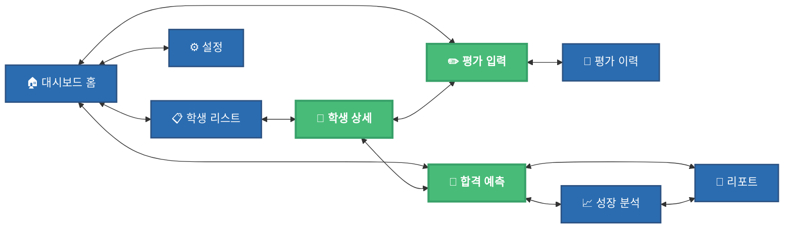

### 5.2 모바일 앱 탭 네비게이션

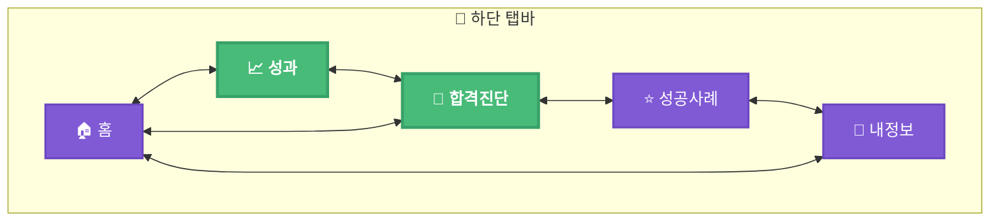

---

## 부록: Mermaid 렌더링 가이드

### 색상 코드

| 용도 | HEX 코드 | 설명 |
|:-----|:---------|:-----|
| **시작/종료** | `#38a169` | 녹색 |
| **Best Case** | `#48bb78` | 밝은 녹색 |
| **프로세스** | `#4299e1` | 파란색 |
| **조건/분기** | `#ecc94b` | 노란색 |
| **입력** | `#63b3ed` | 밝은 파란색 |
| **출력** | `#b794f4` | 보라색 |
| **경고** | `#fc8181` | 빨간색 |
| **AI/엔진** | `#ed8936` | 주황색 |
| **시스템** | `#718096` | 회색 |

### 노드 형태

```
([텍스트])     - 시작/종료 (스타디움)
[텍스트]       - 프로세스 (사각형)
{텍스트}       - 조건 (마름모)
{{텍스트}}     - 조건 (육각형)
[/텍스트/]     - 입력 (평행사변형)
[\텍스트\]     - 출력 (역평행사변형)
((텍스트))     - 연결점 (원)
(((텍스트)))   - 이중원
```

---

**Version**: 1.0 | **Date**: 2026-01-21
