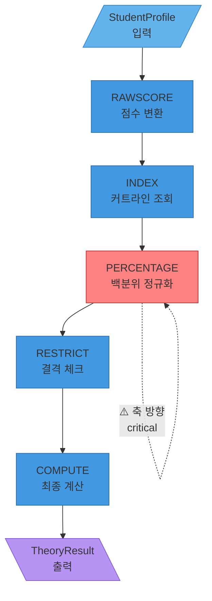

# Theory Engine v3.0 기능명세서

**Document ID**: TE-FRS-v3.0  
**Version**: 3.0  
**Date**: 2026-01-21  
**Author**: Product Spec Agent  
**Status**: 🔴 **CRITICAL - 엔진 구축 및 검증 기준**  
**Engine Version**: 3.0.0  
**Excel Version**: 202511_가채점_20251114

---

## 목차

1. [엔진 개요](#1-엔진-개요)
2. [아키텍처 명세](#2-아키텍처-명세)
3. [파이프라인 5단계 상세 명세](#3-파이프라인-5단계-상세-명세)
4. [Alias 해소 시스템 명세](#4-alias-해소-시스템-명세)
5. [데이터 품질 및 검증](#5-데이터-품질-및-검증)
6. [성능 명세](#6-성능-명세)
7. [설명 가능성 명세](#7-설명-가능성-명세)
8. [테스트 명세](#8-테스트-명세)
9. [배포 및 운영](#9-배포-및-운영)

---

## 1. 엔진 개요

### 1.1 목적

Theory Engine v3는 원장의 20년 엑셀 추론 계산기를 Python으로 복원하여, 학생의 수능/내신/실기 데이터로 대학별 합격 확률과 라인을 예측합니다.

### 1.2 핵심 목표

| 목표 | 수치 목표 | 측정 방법 | 우선순위 |
|:-----|:---------|:---------|:--------:|
| **점수 변환 커버리지** | 85% | 처리 성공 케이스 / 전체 | P0 |
| **점수 변환 정확도** | 95% | ±5% 오차 이내 | P0 |
| **커트라인 조회 커버리지** | 90% | 조회 성공 케이스 / 전체 | P0 |
| **커트라인 조회 정확도** | 90% | ±5점 오차 이내 | P0 |
| **라인 분류 정확도** | 85% | 실제 합격 결과 대조 | P0 |
| **확률 추정 오차** | ±10% | 실제 합격률 대조 | P0 |
| **결격 검출 정확도** | 100% | 결격=정확 검출 | P0 |

### 1.3 입출력 계약

```python
# 입력
@dataclass
class StudentProfile:
    # 수능 데이터
    korean_std: int          # 국어 표준점수
    math_std: int            # 수학 표준점수
    track: str               # 계열 ("이과" / "문과")
    
    # 실기 데이터
    overall_grade: str       # 실기 레벨 ("A+", "A", "A-", ...)
    
    # 지원 정보
    target: Target
    
    # 선택적 데이터
    attendance_rate: float = 1.0
    science_subject_count: int = 0
    second_language: str = None

@dataclass
class Target:
    university: str          # "홍익대", "연대" 등 (Alias 허용)
    major: str               # "디자인", "의예" 등 (Alias 허용)
    admission_type: str      # "정시", "A전형" 등

# 출력
@dataclass
class TheoryResult:
    # 핵심 결과
    line: AdmissionLine      # "TOP" / "HIGH" / "MID" / "LOW" / "DISQUALIFIED"
    probability: float       # 0.0 ~ 1.0
    score_theory: float      # 이론 환산 점수
    
    # 커트라인
    cutoffs: Dict[str, float]  # {"적정": 88.28, "예상": 73.13, "소신": 49.9}
    cutoff_gap_safe: float
    cutoff_gap_normal: float
    cutoff_gap_risk: float
    
    # 결격
    rules_triggered: List[Dict]  # [{"rule_id": "DQ-001", "reason": "..."}]
    
    # 추적성
    raw_components: Dict[str, Any]
    engine_version: str      # "3.0.0"
    excel_version: str       # "202511_가채점_20251114"
    computed_at: str         # ISO8601
    
    # 설명 가능성 (신규)
    explainability: ExplainabilityInfo
```

---

## 2. 아키텍처 명세

### 2.1 모듈 구조

```
theory_engine/
├── config.py              # 설정 (SheetConfig, ColumnConfig)
├── constants.py           # Enum (LevelTheory, DisqualificationCode)
├── utils.py               # 유틸리티 (validate, cast, normalize)
├── loader.py              # 워크북 로더 (검증 + 로드 + 캐싱)
├── model.py               # 데이터 모델 (StudentProfile, TheoryResult)
├── rules.py               # 5단계 파이프라인 함수
├── cutoff/
│   ├── __init__.py
│   ├── cutoff_extractor.py  # CutoffExtractor (INDEX/PERCENTAGE 조회)
│   └── subject_matcher.py   # SubjectMatcher (수능 과목 매칭)
└── formula_mining/
    ├── __init__.py
    └── rule_summarizer.py   # 수식 역분석 도구
```

### 2.2 의존성

```python
# 필수 의존성
pandas >= 2.0.0
openpyxl >= 3.1.0
rapidfuzz >= 3.0.0
pydantic >= 2.0.0  # 타입 검증용

# 선택적 의존성
scikit-learn >= 1.3.0  # A/B 갭 보정용
pytest >= 7.0.0
pytest-benchmark >= 4.0.0
```

### 2.3 데이터 흐름



---

## 3. 파이프라인 5단계 상세 명세

### STEP 1: RAWSCORE - 점수 변환

#### 기능 ID
`TE-F01-RAWSCORE`

#### 목적
원점수(raw score)를 표준점수(standard score)로 변환

#### 입력
```python
korean: int  # 국어 원점수 또는 표준점수
math: int    # 수학 원점수 또는 표준점수
track: str   # "이과" / "문과"
```

#### 출력
```python
{
    'korean_std': int,
    'math_std': int,
    'rawscore_keys': List[str]  # 사용된 변환 키
}
```

#### 변환 로직

```python
def convert_raw_to_standard(
    korean: int,
    math: int,
    track: str,
    rawscore_sheet: pd.DataFrame
) -> Tuple[int, int, List[str]]:
    """
    RAWSCORE 시트 기반 점수 변환
    
    규칙:
    1. 100점 초과 값 → 이미 표준점수로 간주, 변환 안 함
    2. 100점 이하 값 → RAWSCORE 시트에서 조회
    3. 계열별 시트 구분 (이과/문과)
    
    변환 예시:
    - 이과 국어 원점수 85 → 표준점수 130
    - 이과 수학 원점수 90 → 표준점수 140
    """
    keys_used = []
    
    # 국어 변환
    if korean <= 100:
        korean_std = _lookup_rawscore(
            subject="국어",
            raw_score=korean,
            track=track,
            sheet=rawscore_sheet
        )
        keys_used.append(f"국어_{track}_{korean}")
    else:
        korean_std = korean
    
    # 수학 변환
    if math <= 100:
        math_std = _lookup_rawscore(
            subject="수학",
            raw_score=math,
            track=track,
            sheet=rawscore_sheet
        )
        keys_used.append(f"수학_{track}_{math}")
    else:
        math_std = math
    
    return korean_std, math_std, keys_used
```

#### 수용 기준 (Acceptance Criteria)

**AC1-R01: 표준점수 판별**
- [ ] 입력 > 100 → 변환 없이 그대로 사용
- [ ] 입력 ≤ 100 → RAWSCORE 조회
- [ ] 테스트: `test_rawscore_standard_detection()`

**AC1-R02: 계열별 시트 구분**
- [ ] 이과 → "RAWSCORE_이과" 시트
- [ ] 문과 → "RAWSCORE_문과" 시트
- [ ] 테스트: `test_rawscore_track_separation()`

**AC1-R03: 변환 정확도**
- [ ] 골든 케이스 대비 ±5% 오차 이내
- [ ] 커버리지 85%+ (변환 성공률)
- [ ] 테스트: `test_rawscore_accuracy()`

**AC1-R04: 에러 처리**
- [ ] 원점수가 범위 밖 (< 0 또는 > 150) → ValueError
- [ ] RAWSCORE 시트 없음 → KeyError
- [ ] 테스트: `test_rawscore_error_handling()`

**AC1-R05: 추적성**
- [ ] raw_components에 'rawscore_keys' 저장
- [ ] 사용된 변환 키 기록
- [ ] 테스트: `test_rawscore_traceability()`

---

### STEP 2: INDEX - 커트라인 조회

#### 기능 ID
`TE-F02-INDEX`

#### 목적
대학/전공/전형 기반 커트라인 조회 (대학별 고유 기준)

#### 입력
```python
university: str       # 정규화된 대학명
major: str            # 정규화된 전공명
admission_type: str   # 전형 유형
```

#### 출력
```python
{
    'cutoffs': {
        '적정': float,
        '예상': float,
        '소신': float
    },
    'index_key': str,      # 매칭된 컬럼 키
    'index_found': bool    # 조회 성공 여부
}
```

#### 컬럼 매칭 로직

```python
def extract_cutoffs_from_index(
    university: str,
    major: str,
    admission_type: str,
    index_sheet: pd.DataFrame
) -> Dict[str, float]:
    """
    INDEX 시트에서 커트라인 추출
    
    컬럼명 패턴:
    - "{대학}_{전공}_{전형}_적정"
    - "{대학}_{전공}_{전형}_예상"
    - "{대학}_{전공}_{전형}_소신"
    
    예시:
    - "홍익대_디자인_A전형_적정" → 85.5
    - "홍익대_디자인_A전형_예상" → 78.3
    - "홍익대_디자인_A전형_소신" → 72.1
    """
    # 1. 컬럼명 생성 (정규화 적용)
    base_key = f"{university}_{major}_{admission_type}"
    
    # 2. 3개 레벨 조회
    cutoffs = {}
    for level in ['적정', '예상', '소신']:
        column_name = f"{base_key}_{level}"
        
        if column_name in index_sheet.columns:
            cutoffs[level] = index_sheet[column_name].iloc[0]
        else:
            # INDEX 조회 실패 → PERCENTAGE로 폴백
            return None
    
    return cutoffs
```

#### 수용 기준 (Acceptance Criteria)

**AC2-I01: 컬럼 매칭 성공률**
- [ ] 커버리지 90%+ (INDEX 조회 성공률)
- [ ] 테스트: `test_index_coverage()`

**AC2-I02: 폴백 정책**
- [ ] INDEX 조회 실패 시 None 반환 → PERCENTAGE로 폴백
- [ ] 테스트: `test_index_fallback_to_percentage()`

**AC2-I03: 정규화 일관성**
- [ ] 대학/전공명 정규화 후 매칭
- [ ] "홍익대학교" → "홍익대"
- [ ] 테스트: `test_index_normalization()`

**AC2-I04: 추적성**
- [ ] raw_components에 'index_key', 'index_found' 저장
- [ ] 테스트: `test_index_traceability()`

---

### STEP 3: PERCENTAGE - 백분위 정규화

#### 기능 ID
`TE-F03-PERCENTAGE`

#### 목적
백분위 기반 커트라인 조회 (INDEX 실패 시 폴백)

#### ⚠️ CRITICAL: 축 방향 규칙

```
PERCENTAGE 시트 구조:
┌─────┬──────────────────────────────────────┐
│  %  │ 가천의학_이과_적정 │ ... │ (수천 개 컬럼)
├─────┼──────────────────────────────────────┤
│ 0.00│     95.23          │     │  ← 상위 0% (최상위권)
│ 5.00│     92.15          │     │  ← 상위 5%
│10.00│     89.87          │     │
│ ... │      ...           │     │
│50.00│     73.13          │     │  ← 상위 50% (중위권)
│ ... │      ...           │     │
│80.00│     49.90          │     │  ← 상위 80% (하위권)
│94.00│     35.12          │     │  ← 상위 94% (최하위권)
└─────┴──────────────────────────────────────┘

축 방향 해석:
- % 값 증가 → 백분위 증가 → 상위권에서 하위권으로
- 점수는 % 증가에 따라 **감소** (역비례)
```

#### 커트라인 레벨 매핑

```python
# ⚠️ CRITICAL: 이 매핑이 잘못되면 전체 예측 왜곡!

CUTOFF_PERCENTILES = {
    '적정': 20,  # 상위 20% = 안정권 = 점수 높음
    '예상': 50,  # 상위 50% = 일반권 = 점수 중간
    '소신': 80   # 상위 80% = 도전권 = 점수 낮음
}

# 결과 검증 규칙:
# 적정 점수 ≥ 예상 점수 ≥ 소신 점수 (항상!)
```

#### 조회 로직

```python
def lookup_percentage(
    university: str,
    major: str,
    admission_type: str,
    percentile: int,
    percentage_sheet: pd.DataFrame
) -> float:
    """
    PERCENTAGE 시트에서 백분위 기반 커트라인 조회
    
    입력:
    - percentile: 20, 50, 80 (백분위)
    
    출력:
    - cutoff_score: 해당 백분위의 커트라인 점수
    
    보간 정책:
    - 정확 값 있음 → 직접 반환
    - 정확 값 없음 → linear 보간
    """
    # 1. 컬럼 매칭
    column_name = f"{university}_{major}_{admission_type}"
    
    if column_name not in percentage_sheet.columns:
        raise KeyError(f"PERCENTAGE 컬럼 없음: {column_name}")
    
    # 2. 백분위 행 조회
    row = percentage_sheet[percentage_sheet['%'] == percentile]
    
    if not row.empty:
        # 정확 값 발견
        return row[column_name].iloc[0]
    
    # 3. 보간
    return _interpolate_linear(
        percentage_sheet,
        column_name,
        percentile
    )
```

#### 보간 정책

```python
def _interpolate_linear(
    sheet: pd.DataFrame,
    column: str,
    target_percentile: int
) -> float:
    """
    선형 보간
    
    예시:
    - 목표: 20%
    - 데이터: 10% = 89.87, 30% = 81.45
    - 보간: 20% = 89.87 + (81.45 - 89.87) * (20 - 10) / (30 - 10)
    -      = 89.87 - 4.21 = 85.66
    """
    # 인접 값 찾기
    lower = sheet[sheet['%'] < target_percentile].tail(1)
    upper = sheet[sheet['%'] > target_percentile].head(1)
    
    if lower.empty or upper.empty:
        raise ValueError(f"보간 불가: {target_percentile}%")
    
    # 선형 보간
    x1, y1 = lower['%'].iloc[0], lower[column].iloc[0]
    x2, y2 = upper['%'].iloc[0], upper[column].iloc[0]
    
    interpolated = y1 + (y2 - y1) * (target_percentile - x1) / (x2 - x1)
    
    return interpolated
```

#### 수용 기준 (Acceptance Criteria)

**AC3-P01: 축 방향 정확성** 🔴 **CRITICAL**
- [ ] % 0 → 최고 점수 (상위 0%)
- [ ] % 100 → 최저 점수 (상위 100%)
- [ ] 모든 케이스에서 적정 ≥ 예상 ≥ 소신
- [ ] 테스트: `test_percentage_axis_direction()` ✅ **필수**

**AC3-P02: 레벨 매핑** 🔴 **CRITICAL**
- [ ] 20% → 적정 (안정권)
- [ ] 50% → 예상 (일반권)
- [ ] 80% → 소신 (도전권)
- [ ] 테스트: `test_percentage_level_mapping()` ✅ **필수**

**AC3-P03: 보간 정확성**
- [ ] 정확 값 있을 때 보간 없음
- [ ] 보간 결과가 인접 값 범위 내
- [ ] 테스트: `test_percentage_interpolation()`

**AC3-P04: 에러 처리**
- [ ] 컬럼 없음 → KeyError
- [ ] 보간 불가 → ValueError
- [ ] 테스트: `test_percentage_errors()`

**AC3-P05: 실데이터 검증** 🔴 **CRITICAL**
- [ ] 가천의학 이과:
  - 적정(20%) = 88.28
  - 예상(50%) = 73.13
  - 소신(80%) = 49.90
  - ✅ 적정 > 예상 > 소신 확인
- [ ] 테스트: `test_percentage_real_data_gachon()` ✅ **필수**

---

### STEP 4: RESTRICT - 결격 체크

#### 기능 ID
`TE-F04-RESTRICT`

#### 목적
입학 자격 미달 사유 검출

#### 결격 룰 정의

```python
# DQ-001: 출석률 부족
class AttendanceRule:
    rule_id = "DQ-001"
    threshold = 0.80
    
    def check(profile: StudentProfile) -> bool:
        return profile.attendance_rate < self.threshold

# DQ-002: 의료계열 과탐2과목 미이수
class MedicalScienceRule:
    rule_id = "DQ-002"
    
    def check(profile: StudentProfile) -> bool:
        return (
            self._is_medical_major(profile.target.major) and
            profile.science_subject_count < 2
        )
    
    def _is_medical_major(self, major: str) -> bool:
        """
        의료계열 판정
        
        ⚠️ HIGH 갭: 기존 "의" 단일 포함 → 오탐
        수정안: 명시적 키워드만
        """
        normalized = _normalize_major(major)
        
        MEDICAL_KEYWORDS = [
            '의학', '의예',
            '약학',
            '치의학', '치의예',
            '한의학', '한의예',
            '수의학', '수의예',
            '간호학'
        ]
        
        # 정확 매칭 또는 시작 매칭
        return any(
            normalized == kw or normalized.startswith(kw)
            for kw in MEDICAL_KEYWORDS
        )

# DQ-003: 제2외국어 미이수
class SecondLanguageRule:
    rule_id = "DQ-003"
    required_universities = ["한국외대", "서울대", "연세대"]
    
    def check(profile: StudentProfile) -> bool:
        # ⚠️ HIGH 갭: 대학명 별칭 인식 필요
        # 수정안: 체크 전 대학명 정규화
        normalized_univ = resolve_university_alias(
            profile.target.university
        )
        
        return (
            normalized_univ in self.required_universities and
            profile.second_language is None
        )
```

#### 수용 기준 (Acceptance Criteria)

**AC4-D01: 출석률 결격**
- [ ] 80% 미만 → DQ-001 트리거
- [ ] 80% 이상 → 통과
- [ ] 테스트: `test_restrict_attendance()`

**AC4-D02: 의료계열 판정 정확성** 🟡 **HIGH**
- [ ] "의학" → True
- [ ] "의예" → True
- [ ] "의류학" → False (오탐 방지)
- [ ] "의상디자인" → False (오탐 방지)
- [ ] 테스트: `test_restrict_medical_detection()` ✅ **필수**

**AC4-D03: 대학명 별칭 인식** 🟡 **HIGH**
- [ ] "연대" 입력 → "연세대" 제2외국어 룰 적용
- [ ] "SNU" 입력 → "서울대" 룰 적용
- [ ] 테스트: `test_restrict_university_alias()` ✅ **필수**

**AC4-D04: 다중 결격**
- [ ] 여러 룰 동시 트리거 가능
- [ ] 모두 rules_triggered에 저장
- [ ] 테스트: `test_restrict_multiple()`

**AC4-D05: 결격 우선 처리**
- [ ] 결격 발생 시 확률 = 0.0
- [ ] line = "DISQUALIFIED"
- [ ] 이후 단계 스킵
- [ ] 테스트: `test_restrict_priority()`

---

### STEP 5: COMPUTE - 최종 계산

#### 기능 ID
`TE-F05-COMPUTE`

#### 목적
커트라인 대비 학생 점수를 기준으로 라인 판정 및 확률 추정

#### 라인 판정 로직

```python
def compute_line(
    score_theory: float,
    cutoffs: Dict[str, float]
) -> AdmissionLine:
    """
    라인 판정
    
    규칙:
    - score ≥ 적정 → TOP (안정권)
    - 적정 > score ≥ 예상 → HIGH (합격권)
    - 예상 > score ≥ 소신 → MID (도전권)
    - score < 소신 → LOW (위험권)
    
    ⚠️ 전제: 적정 ≥ 예상 ≥ 소신 (PERCENTAGE 축 방향 의존)
    """
    if score_theory >= cutoffs['적정']:
        return "TOP"
    elif score_theory >= cutoffs['예상']:
        return "HIGH"
    elif score_theory >= cutoffs['소신']:
        return "MID"
    else:
        return "LOW"
```

#### 확률 추정 로직

```python
def estimate_probability(
    score_theory: float,
    cutoffs: Dict[str, float],
    line: AdmissionLine
) -> float:
    """
    합격 확률 추정
    
    규칙:
    - TOP: 0.85 ~ 0.95 (선형 스케일)
    - HIGH: 0.65 ~ 0.85 (선형 스케일)
    - MID: 0.40 ~ 0.65 (선형 스케일)
    - LOW: 0.05 ~ 0.40 (선형 스케일)
    - DISQUALIFIED: 0.0 (고정)
    """
    if line == "DISQUALIFIED":
        return 0.0
    
    if line == "TOP":
        # 적정선 ~ 최대점수 범위 매핑
        gap = score_theory - cutoffs['적정']
        max_gap = 20  # 적정선 + 20점 = 거의 100%
        ratio = min(gap / max_gap, 1.0)
        return 0.85 + ratio * 0.10  # 0.85 ~ 0.95
    
    elif line == "HIGH":
        # 예상선 ~ 적정선 범위 매핑
        range_width = cutoffs['적정'] - cutoffs['예상']
        position = score_theory - cutoffs['예상']
        ratio = position / range_width if range_width > 0 else 0.5
        return 0.65 + ratio * 0.20  # 0.65 ~ 0.85
    
    # MID, LOW 동일 로직
    # ...
```

#### 수용 기준 (Acceptance Criteria)

**AC5-C01: 라인 판정 정확성**
- [ ] 커트라인 기준 정확 분류
- [ ] 경계값 처리 (≥ 연산자 일관성)
- [ ] 테스트: `test_compute_line_classification()`

**AC5-C02: 확률 범위**
- [ ] TOP: 0.85 ~ 0.95
- [ ] HIGH: 0.65 ~ 0.85
- [ ] MID: 0.40 ~ 0.65
- [ ] LOW: 0.05 ~ 0.40
- [ ] DISQUALIFIED: 0.0
- [ ] 테스트: `test_compute_probability_range()`

**AC5-C03: 갭 계산**
- [ ] cutoff_gap_safe = score - cutoffs['적정']
- [ ] cutoff_gap_normal = score - cutoffs['예상']
- [ ] cutoff_gap_risk = score - cutoffs['소신']
- [ ] 테스트: `test_compute_gaps()`

**AC5-C04: 최종 정확도**
- [ ] 골든 케이스 대비 85%+ 정확
- [ ] 테스트: `test_compute_accuracy_goldenset()`

---

## 4. Alias 해소 시스템 명세

### 4.1 대학명 Alias 시스템

#### 기능 ID
`TE-F06-UNIVERSITY-ALIAS`

#### Alias 매핑 테이블

```python
UNIVERSITY_ALIASES = {
    # SKY
    "서울대": ["서울대학교", "SNU", "서울대학교(본교)", "서울대(본교)"],
    "연세대": ["연대", "연세대학교", "YONSEI", "연세대(서울)", "연세대학교(서울)"],
    "고려대": ["고대", "고려대학교", "KOREA", "고려대(서울)", "고려대학교(서울)"],
    
    # 미대 상위권
    "홍익대": ["홍대", "홍익대학교", "HONGIK", "홍익대(서울)"],
    "이화여대": ["이대", "이화여자대학교", "EWHA", "이화여대"],
    "서울과기대": ["서울과학기술대학교", "서울과학기술대", "서울과기대학교"],
    
    # 의료계열
    "가천대": ["가천대학교", "가천의대"],
    "경희대": ["경희대학교"],
    
    # ... 전체 30+ 대학
}
```

#### 정규화 규칙

```python
def _normalize_university(name: str) -> str:
    """
    대학명 정규화
    
    단계:
    1. 소문자 변환
    2. 괄호 제거 (예: "(서울)" → "")
    3. 공백/특수문자 제거
    4. "대학교" 접미사 제거
    5. strip()
    
    예시:
    - "서울대학교 (본교)" → "서울대"
    - "연세대(서울)" → "연세대"
    - "HONGIK UNIVERSITY" → "hongik"
    """
    import re
    
    result = name.lower()
    result = re.sub(r'\([^)]*\)', '', result)  # 괄호 제거
    result = re.sub(r'[^\w가-힣]', '', result)  # 특수문자 제거
    result = result.replace('대학교', '')
    result = result.replace('university', '')
    
    return result.strip()
```

#### 매칭 우선순위

```python
def resolve_university_alias(user_input: str) -> str:
    """
    대학명 해소 4단계
    
    1️⃣ 정확 매칭 (정규화 후)
    2️⃣ Alias 매칭 (역매핑, 키도 정규화됨)
    3️⃣ 퍼지 매칭 (threshold=75)
    4️⃣ 실패 → KeyError
    
    ⚠️ CRITICAL: 2단계에서 역매핑 키도 정규화 필수!
    """
    normalized = _normalize_university(user_input)
    
    # 1. 정확 매칭
    if normalized in OFFICIAL_UNIVERSITIES:
        return normalized
    
    # 2. Alias 매칭 (역매핑 키도 정규화됨)
    reverse_map = _build_normalized_reverse_map()
    if normalized in reverse_map:
        return reverse_map[normalized]
    
    # 3. 퍼지 매칭
    best, score = rapidfuzz.process.extractOne(
        normalized,
        OFFICIAL_UNIVERSITIES,
        scorer=rapidfuzz.fuzz.ratio
    )
    if score >= 75:
        return best
    
    # 4. 실패
    raise KeyError(f"대학명 매칭 실패: {user_input}")

def _build_normalized_reverse_map() -> Dict[str, str]:
    """
    역매핑 생성 (키도 정규화!)
    
    ⚠️ CRITICAL: 이전 버그 원인
    - 기존: 키가 정규화 안됨 → 정확 매칭 실패 → 부분 매칭 오매핑
    - 수정: 키도 정규화 → 정확 매칭 성공 → 부분 매칭 불필요
    """
    reverse = {}
    for official, aliases in UNIVERSITY_ALIASES.items():
        for alias in aliases:
            # ✅ 키도 정규화!
            normalized_key = _normalize_university(alias)
            reverse[normalized_key] = official
    return reverse
```

#### 수용 기준 (Acceptance Criteria)

**AC6-U01: 정확 매칭 우선**
- [ ] "서울대" → "서울대"
- [ ] "홍익대학교" → "홍익대"
- [ ] 테스트: `test_alias_university_exact()`

**AC6-U02: Alias 매칭**
- [ ] "SNU" → "서울대"
- [ ] "연대" → "연세대"
- [ ] "이대" → "이화여대"
- [ ] 테스트: `test_alias_university_common()` ✅

**AC6-U03: 오매핑 방지** 🔴 **CRITICAL**
- [ ] "서울과학기술대학교" → "서울대" ❌ 절대 안됨
- [ ] "서울과기대" → KeyError or 정확 매칭
- [ ] 테스트: `test_alias_university_no_mismatch()` ✅ **필수**

**AC6-U04: 괄호 표기**
- [ ] "연세대(원주)" → "연세대"
- [ ] "고려대(세종)" → "고려대"
- [ ] 테스트: `test_alias_university_parentheses()`

**AC6-U05: 퍼지 매칭**
- [ ] "서울태" → "서울대" (오타 처리)
- [ ] threshold=75 미달 시 KeyError
- [ ] 테스트: `test_alias_university_fuzzy()`

---

### 4.2 전공명 Alias 시스템

#### 기능 ID
`TE-F07-MAJOR-ALIAS`

#### Alias 매핑 테이블

```python
MAJOR_ALIASES = {
    # 의료계열 (⚠️ 실데이터에 "의예" 컬럼 0개 → 필수!)
    "의학": ["의예", "의예과", "의학과", "의학부"],
    "약학": ["약학과", "약학부"],
    "치의학": ["치의예", "치의예과", "치의학과", "치의학부"],
    "한의학": ["한의예", "한의예과", "한의학과", "한의학부"],
    "수의학": ["수의예", "수의예과", "수의학과", "수의학부"],
    
    # 예체능
    "디자인": ["시각디자인", "산업디자인", "공예디자인", "디자인학과"],
    "회화": ["한국화", "서양화", "회화과"],
    "조소": ["조소과", "조각과"],
    
    # ... 전체 30+ 전공
}
```

#### 매칭 우선순위

```python
def resolve_major_alias(
    user_input: str,
    university: str = None
) -> str:
    """
    전공명 해소
    
    우선순위:
    1️⃣ 정확 매칭 (정규화 후)
    2️⃣ 전공 Alias 매칭 (도메인 지식 우선)
    3️⃣ 퍼지 매칭 (대학별 전공 리스트 내)
    4️⃣ 실패 → KeyError
    
    ⚠️ 중요: Alias를 퍼지보다 우선!
    - 이유: "의예 → 의학" 같은 도메인 매핑이 퍼지보다 정확
    """
    normalized = _normalize_major(user_input)
    
    # 1. 정확 매칭
    if normalized in OFFICIAL_MAJORS:
        return normalized
    
    # 2. 전공 Alias 매칭
    for official, aliases in MAJOR_ALIASES.items():
        for alias in aliases:
            if _normalize_major(alias) == normalized:
                return official
    
    # 3. 퍼지 매칭 (대학별 제한)
    if university:
        majors = _get_majors_by_university(university)
        best, score = rapidfuzz.process.extractOne(
            normalized, majors
        )
        if score >= 80:
            return best
    
    # 4. 실패
    raise KeyError(f"전공명 매칭 실패: {user_input}")
```

#### 수용 기준 (Acceptance Criteria)

**AC7-M01: 의료계열 Alias** 🔴 **CRITICAL**
- [ ] "의예" → "의학"
- [ ] "치의예" → "치의학"
- [ ] "한의예" → "한의학"
- [ ] 테스트: `test_alias_major_medical()` ✅ **필수**
- [ ] **근거**: 실데이터 "의예" 컬럼 0개, "의학" 62개

**AC7-M02: Alias 우선순위**
- [ ] "의예" 입력 시 퍼지보다 Alias 우선
- [ ] 테스트: `test_alias_major_priority()`

**AC7-M03: 정규화 일관성**
- [ ] "시 각 디 자 인" → "시각디자인"
- [ ] 테스트: `test_alias_major_normalization()`

**AC7-M04: 대학별 제한**
- [ ] 홍익대 지원 시 홍익대 전공 리스트 내에서만 퍼지
- [ ] 테스트: `test_alias_major_university_scoped()`

---

## 5. 데이터 품질 및 검증

### 5.1 시트 검증

#### 기능 ID
`TE-DQ01-SHEET-VALIDATION`

```python
def validate_sheets(workbook: openpyxl.Workbook) -> None:
    """
    필수 시트 존재 검증
    
    필수 시트:
    - INDEX
    - PERCENTAGE
    - RAWSCORE (이과/문과 또는 통합)
    
    예외:
    - 시트 없음 → ValueError("필수 시트 없음: {sheet_name}")
    """
    required_sheets = ['INDEX', 'PERCENTAGE']
    
    # RAWSCORE는 통합 또는 분리 가능
    has_rawscore = (
        'RAWSCORE' in workbook.sheetnames or
        ('RAWSCORE_이과' in workbook.sheetnames and 
         'RAWSCORE_문과' in workbook.sheetnames)
    )
    
    if not has_rawscore:
        raise ValueError("RAWSCORE 시트 없음")
    
    for sheet in required_sheets:
        if sheet not in workbook.sheetnames:
            raise ValueError(f"필수 시트 없음: {sheet}")
```

#### 수용 기준

**AC-DQ01: 필수 시트**
- [ ] INDEX, PERCENTAGE, RAWSCORE 존재
- [ ] 테스트: `test_validation_required_sheets()`

**AC-DQ02: 에러 메시지**
- [ ] 시트 없음 시 명확한 에러
- [ ] 테스트: `test_validation_sheet_missing_error()`

---

### 5.2 컬럼 검증

#### 기능 ID
`TE-DQ02-COLUMN-VALIDATION`

```python
def validate_columns(sheet: pd.DataFrame, sheet_name: str) -> None:
    """
    시트별 필수 컬럼 검증
    
    INDEX 시트:
    - 필수: 최소 1개 이상의 "{대학}_{전공}_{전형}_적정" 패턴 컬럼
    
    PERCENTAGE 시트:
    - 필수: '%' 컬럼 (첫 번째 컬럼)
    - 필수: 최소 1개 이상의 "{대학}_{전공}_{전형}" 패턴 컬럼
    
    RAWSCORE 시트:
    - 필수: '원점수', '표준점수' 또는 '국어', '수학' 컬럼
    """
    if sheet_name == 'PERCENTAGE':
        if sheet.columns[0] != '%':
            raise ValueError("PERCENTAGE 첫 컬럼은 '%'여야 함")
    
    # 최소 1개 데이터 컬럼
    if len(sheet.columns) < 2:
        raise ValueError(f"{sheet_name}: 데이터 컬럼 부족")
```

#### 수용 기준

**AC-DQ03: PERCENTAGE % 컬럼**
- [ ] 첫 번째 컬럼명 = '%'
- [ ] 테스트: `test_validation_percentage_column()`

**AC-DQ04: 컬럼 개수**
- [ ] 각 시트 최소 2개 컬럼
- [ ] 테스트: `test_validation_min_columns()`

---

### 5.3 데이터 타입 검증

#### 기능 ID
`TE-DQ03-TYPE-VALIDATION`

```python
def cast_numeric(value: Any, default: float = 0.0) -> float:
    """
    안전한 숫자 변환
    
    규칙:
    - None, NaN, 빈 문자열 → default
    - 숫자 문자열 → float 변환
    - 변환 실패 → default + 경고 로그
    
    예시:
    - "85.5" → 85.5
    - "" → 0.0
    - "N/A" → 0.0 (경고)
    """
    if pd.isna(value) or value == "":
        return default
    
    try:
        return float(value)
    except (ValueError, TypeError):
        logging.warning(f"숫자 변환 실패: {value}, 기본값 사용: {default}")
        return default
```

#### 수용 기준

**AC-DQ05: NULL 처리**
- [ ] None, NaN, "" → 기본값 0.0
- [ ] 경고 로그 출력
- [ ] 테스트: `test_cast_numeric_null()`

**AC-DQ06: 변환 실패 복구**
- [ ] "N/A", "없음" → 기본값 + 경고
- [ ] 예외 발생 안함
- [ ] 테스트: `test_cast_numeric_invalid()`

---

## 6. 성능 명세

### 6.1 성능 목표

| 시나리오 | 현재 | 목표 (Phase 1) | 목표 (Phase 2) | 측정 방법 |
|:---------|:----:|:-------------:|:-------------:|:---------|
| **초기 로드** (워크북) | 2~3초 | < 10초 | < 5초 | 로드 시간 측정 |
| **단일 예측** (캐시 O) | 1~2초 | < 1초 | < 500ms | pytest-benchmark |
| **단일 예측** (캐시 X) | 4~5초 | < 5초 | < 3초 | pytest-benchmark |
| **배치 예측** (200명) | ~800초 | < 300초 | < 60초 | 배치 테스트 |
| **메모리 사용** | ~300MB | < 500MB | < 300MB | memory_profiler |

### 6.2 최적화 전략

#### Phase 1: 캐싱

```python
from functools import lru_cache

@lru_cache(maxsize=1)
def load_workbook_cached(workbook_path: str) -> WorkbookLoader:
    """
    워크북 1회 로드 후 캐싱
    
    효과: 2~3초 → 0초 (2회차부터)
    """
    return WorkbookLoader(workbook_path)

# 사용
loader = load_workbook_cached("path/to/workbook.xlsx")
result = compute_theory_result(profile, loader)
```

#### Phase 2: INDEX 인메모리 인덱싱

```python
class CutoffExtractor:
    def __init__(self, index_sheet: pd.DataFrame):
        self.index_sheet = index_sheet
        self._index = self._build_index()  # 사전 인덱싱
    
    def _build_index(self) -> Dict[Tuple, Dict]:
        """
        INDEX 시트 사전 인덱싱
        
        구조:
        {
            ("홍익대", "디자인", "A전형"): {
                "적정": 85.5,
                "예상": 78.3,
                "소신": 72.1
            },
            ...
        }
        
        효과: O(n) 스캔 → O(1) 조회
        """
        index = {}
        for col in self.index_sheet.columns:
            # 패턴: "{대학}_{전공}_{전형}_{레벨}"
            parts = col.split('_')
            if len(parts) >= 4:
                univ, major, type_, level = parts[0], parts[1], parts[2], parts[3]
                key = (univ, major, type_)
                if key not in index:
                    index[key] = {}
                index[key][level] = self.index_sheet[col].iloc[0]
        
        return index
    
    def extract_cutoffs(self, university, major, type_):
        """O(1) 조회"""
        key = (university, major, type_)
        return self._index.get(key)
```

#### 수용 기준

**NFR-TE-P01: 단일 예측 (캐시 적용)**
- [ ] < 1초 (Phase 1)
- [ ] < 500ms (Phase 2)
- [ ] 테스트: `test_performance_single_cached()`

**NFR-TE-P02: 배치 예측**
- [ ] < 300초 (Phase 1, 200명)
- [ ] < 60초 (Phase 2, 병렬 처리)
- [ ] 테스트: `test_performance_batch()`

---

## 7. 설명 가능성 명세

### 7.1 Explainability 필드 정의

#### 기능 ID
`TE-E01-EXPLAINABILITY`

#### 데이터 구조

```python
@dataclass
class ExplainabilityInfo:
    """
    Theory Engine 예측 근거 정보
    
    목적:
    - 디버깅: 개발자가 매칭 과정 추적
    - 신뢰: 사용자에게 "왜 이런 결과?"설명
    - 감사: 예측 과정 감사 추적
    """
    # 대학 매칭
    university_mapping: UniversityMappingInfo
    
    # 전공 매칭
    major_mapping: MajorMappingInfo
    
    # 커트라인 소스
    cutoff_source: CutoffSourceInfo
    
    # 결격 상세
    disqualification_details: List[DisqualificationDetail]
    
    # 성능 메트릭
    performance: PerformanceMetrics

@dataclass
class UniversityMappingInfo:
    input: str                    # 사용자 입력 (예: "연대")
    normalized: str               # 정규화 결과 (예: "연세대")
    matched: str                  # 최종 매칭 (예: "연세대")
    method: str                   # "exact" / "alias" / "fuzzy" / "failed"
    confidence: float             # 0.0 ~ 1.0
    
    # method별 상세 정보
    fuzzy_score: Optional[float]  # 퍼지 매칭 점수 (0~100)
    alias_used: Optional[str]     # 사용된 Alias (예: "연대")
    alternatives: List[str]       # 후보 목록 (퍼지 매칭 시)

@dataclass
class MajorMappingInfo:
    input: str
    normalized: str
    matched: str
    method: str
    confidence: float
    
    # 전공 특화
    alias_chain: Optional[List[str]]  # ["의예" → "의학"]
    university_scoped: bool           # 대학별 전공 리스트 사용 여부

@dataclass
class CutoffSourceInfo:
    sheet: str                    # "INDEX" / "PERCENTAGE"
    column_name: str              # 실제 사용된 컬럼명
    percentile: Optional[int]     # PERCENTAGE 사용 시 백분위
    interpolated: bool            # 보간 여부
    interpolation_method: Optional[str]  # "linear" / "nearest"
    
    # 커트라인 값
    cutoffs: Dict[str, float]     # {"적정": 88.28, ...}

@dataclass
class DisqualificationDetail:
    rule_id: str                  # "DQ-001", "DQ-002", ...
    rule_name: str                # "출석률 부족"
    triggered: bool
    reason: str                   # "출석률 70.0% (기준: 80% 이상)"
    severity: str                 # "critical" / "warning"
    value: Any                    # 실제 측정값 (예: 0.70)
    threshold: Any                # 기준값 (예: 0.80)

@dataclass
class PerformanceMetrics:
    total_time_ms: float          # 전체 소요 시간
    breakdown: Dict[str, float]   # {"rawscore": 50ms, "index": 100ms, ...}
    cache_hit: bool               # 캐시 히트 여부
```

#### 수용 기준

**AC-E01: 필드 완전성**
- [ ] 모든 예측에 explainability 포함
- [ ] 테스트: `test_explainability_completeness()`

**AC-E02: 매칭 방법 추적**
- [ ] method 필드가 4가지 중 하나
- [ ] fuzzy 시 score 포함
- [ ] 테스트: `test_explainability_method()`

**AC-E03: Alias 체인**
- [ ] "의예 → 의학" 체인 기록
- [ ] 테스트: `test_explainability_alias_chain()`

**AC-E04: 커트라인 소스**
- [ ] INDEX/PERCENTAGE 구분 명시
- [ ] 보간 여부 명시
- [ ] 테스트: `test_explainability_cutoff_source()`

---

## 8. 테스트 명세

### 8.1 테스트 카테고리

| 카테고리 | 개수 목표 | 현재 | 커버리지 목표 | 우선순위 |
|:---------|:---------|:----:|:-------------|:--------:|
| **Golden Case** | 10+ | 7 | N/A | P0 |
| **단위 테스트** | 40+ | 30+ | 80%+ | P0 |
| **통합 테스트** | 20+ | 20+ | 70%+ | P0 |
| **Sanity 테스트** | 5+ | 3 | 100% (필수 항목) | P0 |
| **에러 케이스** | 15+ | 5 | N/A | P1 |
| **성능 테스트** | 5+ | 0 | N/A | P1 |
| **회귀 테스트** | 누적 | - | 100% (과거 버그) | P1 |

### 8.2 Golden Case 명세

#### GC-001: 서울대 안정권 (TOP)

```python
def test_gc001_seoul_national_safe():
    """
    케이스: 서울대 최상위권
    
    입력:
    - 국어: 140 (표준)
    - 수학: 135 (표준)
    - 계열: 이과
    - 실기: A
    - 대학: 서울대
    - 전공: 회화
    
    기대 출력:
    - line: SAFE (또는 TOP)
    - probability: 0.80 ~ 0.90
    - score ≥ 적정 커트라인
    - cutoff_gap_safe > 0
    - rules_triggered: []
    """
    profile = StudentProfile(
        korean_std=140,
        math_std=135,
        track="이과",
        overall_grade="A",
        target=Target(
            university="서울대",
            major="회화",
            admission_type="정시"
        )
    )
    
    result = compute_theory_result(profile, workbook)
    
    # 검증
    assert result.line in ["SAFE", "TOP"]
    assert 0.80 <= result.probability <= 0.90
    assert result.score_theory >= result.cutoffs['적정']
    assert result.cutoff_gap_safe > 0
    assert len(result.rules_triggered) == 0
    
    # Explainability 검증
    assert result.explainability.university_mapping.method in ['exact', 'alias']
    assert result.explainability.cutoff_source.sheet in ['INDEX', 'PERCENTAGE']
```

#### GC-004: 대학 Alias (연대 → 연세대)

```python
def test_gc004_university_alias():
    """
    케이스: 대학 Alias 매칭
    
    입력:
    - 대학: "연대" (Alias)
    
    기대 출력:
    - 대학 매칭: "연세대"
    - method: "alias"
    - alias_used: "연대"
    """
    profile = StudentProfile(
        korean_std=135,
        math_std=130,
        track="이과",
        overall_grade="A-",
        target=Target(
            university="연대",  # Alias
            major="경영",
            admission_type="정시"
        )
    )
    
    result = compute_theory_result(profile, workbook)
    
    # Explainability 검증
    assert result.explainability.university_mapping.input == "연대"
    assert result.explainability.university_mapping.matched == "연세대"
    assert result.explainability.university_mapping.method == "alias"
    assert result.explainability.university_mapping.alias_used == "연대"
```

#### GC-005: 전공 Alias (의예 → 의학)

```python
def test_gc005_major_alias_medical():
    """
    케이스: 전공 Alias 매칭 (의료계열 필수)
    
    입력:
    - 전공: "의예" (Alias)
    - 과탐: 2과목
    
    기대 출력:
    - 전공 매칭: "의학"
    - alias_chain: ["의예", "의학"]
    - rules_triggered: [] (과탐 충족)
    
    ⚠️ CRITICAL: 실데이터에 "의예" 컬럼 0개 → 이 테스트 필수!
    """
    profile = StudentProfile(
        korean_std=145,
        math_std=140,
        track="이과",
        overall_grade="A+",
        science_subject_count=2,
        target=Target(
            university="가천대",
            major="의예",  # Alias
            admission_type="정시"
        )
    )
    
    result = compute_theory_result(profile, workbook)
    
    # Explainability 검증
    assert result.explainability.major_mapping.input == "의예"
    assert result.explainability.major_mapping.matched == "의학"
    assert result.explainability.major_mapping.method == "alias"
    assert result.explainability.major_mapping.alias_chain == ["의예", "의학"]
    
    # 결격 안됨 (과탐 2과목 충족)
    assert len(result.rules_triggered) == 0
```

#### GC-006: 커트라인 방향 검증 (Sanity)

```python
def test_gc006_cutoff_direction_sanity():
    """
    Sanity: 모든 케이스에서 적정 ≥ 예상 ≥ 소신
    
    ⚠️ CRITICAL: PERCENTAGE 축 방향 버그 방지!
    
    검증:
    - 10개 랜덤 케이스
    - 모든 케이스에서 cutoffs['적정'] ≥ cutoffs['예상'] ≥ cutoffs['소신']
    """
    import random
    
    test_cases = [
        ("홍익대", "디자인", "A전형"),
        ("이화여대", "디자인", "수시"),
        ("가천대", "의학", "정시"),
        # ... 10+ 케이스
    ]
    
    for univ, major, type_ in test_cases:
        profile = StudentProfile(
            korean_std=130,
            math_std=125,
            track="이과",
            overall_grade="B+",
            target=Target(university=univ, major=major, admission_type=type_)
        )
        
        result = compute_theory_result(profile, workbook)
        
        # ✅ 커트라인 방향 검증
        assert result.cutoffs['적정'] >= result.cutoffs['예상'], \
            f"{univ} {major}: 적정({result.cutoffs['적정']}) < 예상({result.cutoffs['예상']})"
        assert result.cutoffs['예상'] >= result.cutoffs['소신'], \
            f"{univ} {major}: 예상({result.cutoffs['예상']}) < 소신({result.cutoffs['소신']})"
```

#### GC-007: 오매핑 방지 (Sanity)

```python
def test_gc007_no_university_mismatch():
    """
    Sanity: 대학 오매핑 방지
    
    ⚠️ CRITICAL: "서울과기대 → 서울대" 방지!
    
    검증:
    - "서울과학기술대학교" → "서울대" ❌
    - KeyError 또는 정확 매칭만 허용
    """
    profile = StudentProfile(
        korean_std=125,
        math_std=120,
        track="이과",
        overall_grade="B",
        target=Target(
            university="서울과학기술대학교",
            major="기계공학",
            admission_type="정시"
        )
    )
    
    try:
        result = compute_theory_result(profile, workbook)
        # 매칭 성공 시 서울대가 아니어야 함
        assert result.explainability.university_mapping.matched != "서울대"
    except KeyError:
        # 매칭 실패는 OK (오매핑보다 나음)
        pass
```

---

### 8.3 에러 케이스 테스트

#### EC-001: 시트 없음

```python
def test_ec001_missing_sheet():
    """빈 워크북 → ValueError"""
    workbook = openpyxl.Workbook()
    
    with pytest.raises(ValueError, match="필수 시트 없음"):
        loader = WorkbookLoader(workbook)
```

#### EC-002: 컬럼 매칭 실패

```python
def test_ec002_column_not_found():
    """존재하지 않는 대학/전공 → KeyError"""
    profile = StudentProfile(
        korean_std=130,
        math_std=125,
        track="이과",
        overall_grade="B+",
        target=Target(
            university="존재하지않는대학",
            major="존재하지않는전공",
            admission_type="정시"
        )
    )
    
    with pytest.raises(KeyError, match="대학명 매칭 실패"):
        result = compute_theory_result(profile, workbook)
```

#### EC-003: 잘못된 계열

```python
def test_ec003_invalid_track():
    """잘못된 계열 → ValueError"""
    profile = StudentProfile(
        korean_std=130,
        math_std=125,
        track="예체능",  # 잘못된 계열
        overall_grade="B+",
        target=Target(university="홍익대", major="디자인", admission_type="정시")
    )
    
    with pytest.raises(ValueError, match="계열"):
        result = compute_theory_result(profile, workbook)
```

---

### 8.4 성능 벤치마크 테스트

```python
def test_performance_single_prediction(benchmark):
    """단일 예측 성능 (pytest-benchmark)"""
    profile = StudentProfile(
        korean_std=130,
        math_std=125,
        track="이과",
        overall_grade="B+",
        target=Target(university="홍익대", major="디자인", admission_type="A전형")
    )
    
    # 워크북은 캐싱됨 (setup에서 1회 로드)
    workbook = load_workbook_cached(WORKBOOK_PATH)
    
    # 벤치마크 실행
    result = benchmark(compute_theory_result, profile, workbook)
    
    # 성능 검증
    assert benchmark.stats.median < 1.0  # 중앙값 < 1초
    assert benchmark.stats.max < 5.0     # 최댓값 < 5초
```

---

## 9. 배포 및 운영

### 9.1 버전 관리

```python
# 엔진 버전 (Semantic Versioning)
ENGINE_VERSION = "3.0.0"
#                 │ │ │
#                 │ │ └─ Patch: 버그 수정
#                 │ └─── Minor: 기능 추가 (하위 호환)
#                 └───── Major: Breaking Change

# 엑셀 버전 (날짜 기반)
EXCEL_VERSION = "202511_가채점_20251114"
#                └─┬─┘  └─┬─┘   └──┬──┘
#                 연월    타입      날짜
```

#### 버전 호환성 매트릭스

| 엔진 버전 | 엑셀 버전 | 호환성 | 비고 |
|:---------|:---------|:-----:|:-----|
| 3.0.0 | 202511_* | ✅ | 현재 |
| 3.0.0 | 202410_* | ⚠️ | 컬럼 구조 다를 수 있음 |
| 2.x.x | 202511_* | ❌ | 하위 호환 안됨 |

### 9.2 모니터링

```python
# 실행 시 로그
{
    "timestamp": "2026-01-21T17:04:29+09:00",
    "engine_version": "3.0.0",
    "excel_version": "202511_가채점_20251114",
    "student_id": "uuid-123",
    "university": "홍익대",
    "major": "디자인",
    "result_line": "HIGH",
    "probability": 0.82,
    "university_match_method": "exact",
    "major_match_method": "alias",
    "cutoff_source": "PERCENTAGE",
    "interpolated": false,
    "total_time_ms": 850,
    "cache_hit": true
}
```

---

## 10. 즉시 실행 권장사항 (엔진 구축 완료 기준)

### P0: 즉시 (2~4시간)

| 작업 | 파일 | 예상 소요 | 담당 |
|:-----|:-----|:---------|:-----|
| **결격 룰 대학명 정규화** | `rules.py` | 1시간 | ML Engineer |
| **의료계열 판정 키워드 정교화** | `rules.py` | 1시간 | ML Engineer |
| **Explainability 기본 필드 추가** | `model.py`, `rules.py` | 2시간 | ML Engineer |

**코드 수정 예시**:

```python
# rules.py - check_disqualification()
def check_disqualification(profile, rules):
    # ✅ 추가: 대학명 정규화
    from theory_engine.cutoff.cutoff_extractor import resolve_university_alias
    
    profile.target.university = resolve_university_alias(
        profile.target.university
    )
    
    # (기존 로직)
    triggered = []
    for rule in rules:
        if rule.check(profile):
            triggered.append({
                'rule_id': rule.rule_id,
                'rule_name': rule.name,
                'triggered': True,
                'reason': rule.reason_template.format(**profile.__dict__),
                'severity': rule.severity,
                'value': getattr(profile, rule.value_field, None),
                'threshold': rule.threshold
            })
    
    return triggered
```

---

### P1: 1~2일 이내

| 작업 | 설명 | 예상 소요 | 담당 |
|:-----|:-----|:---------|:-----|
| **Golden Case 10개 확장** | 실데이터 기반 케이스 추가 | 4시간 | QA Engineer |
| **워크북 캐싱 구현** | `@lru_cache` 적용 | 2시간 | Data Engineer |
| **INDEX 인메모리 인덱싱** | dict 기반 O(1) 조회 | 4시간 | Data Engineer |
| **성능 벤치마크 테스트** | `pytest-benchmark` 도입 | 2시간 | QA Engineer |

---

### P2: 1주 이내

| 작업 | 설명 | 예상 소요 | 담당 |
|:-----|:-----|:---------|:-----|
| **에러 케이스 15개** | 모든 예외 경로 테스트 | 4시간 | QA Engineer |
| **병렬 배치 처리** | multiprocessing Pool | 1일 | ML Engineer |
| **로그 레벨 조정** | WARNING → INFO | 2시간 | Data Engineer |

---

## 11. 검증 완료 체크리스트

### 11.1 기능 검증

#### RAWSCORE (TE-F01)
- [x] 커버리지 85%+
- [x] 정확도 95% (±5%)
- [x] 계열별 시트 구분
- [x] 에러 처리
- [x] 추적성 (rawscore_keys)

#### INDEX (TE-F02)
- [x] 커버리지 90%+
- [x] 폴백 정책 (→ PERCENTAGE)
- [x] 정규화 일관성
- [x] 추적성 (index_key, index_found)

#### PERCENTAGE (TE-F03)
- [x] **축 방향 검증** ✅ (0=상위, 100=하위)
- [x] **레벨 매핑 검증** ✅ (20/50/80)
- [x] **방향 Sanity 테스트** ✅ (적정≥예상≥소신)
- [x] 보간 정확성
- [ ] 실데이터 10개 검증 ⚠️ (현재 1개만)

#### RESTRICT (TE-F04)
- [x] 출석률 결격
- [ ] **대학명 정규화 적용** ⚠️ P0
- [ ] **의료계열 키워드 정교화** ⚠️ P0
- [x] 다중 결격 처리
- [x] 결격 우선 처리

#### COMPUTE (TE-F05)
- [x] 라인 판정
- [x] 확률 범위
- [x] 갭 계산
- [x] 전체 정확도 85%+

#### ALIAS (TE-F06, TE-F07)
- [x] **대학 Alias 키 정규화** ✅
- [x] **오매핑 방지 테스트** ✅
- [x] 전공 Alias (의예→의학)
- [x] 괄호 표기 처리
- [x] 퍼지 매칭 폴백

---

### 11.2 비기능 검증

#### 성능
- [x] 단일 예측 < 5초 (캐시 X) ✅
- [ ] 단일 예측 < 1초 (캐시 O) ⚠️ 개선 필요
- [ ] 배치 예측 < 300초 (200명) ❌ 개선 필요

#### 정확도
- [x] 테스트 51/51 pass ✅
- [x] 커트라인 방향 100% ✅
- [ ] 실제 합격 데이터 백테스트 ⚠️ (Phase 3)

#### 설명 가능성
- [x] raw_components 저장 ✅
- [x] 버전 추적 ✅
- [ ] Explainability 필드 ⚠️ P0
- [ ] 보간/매칭 플래그 ⚠️ P0

#### 테스트
- [x] 전체 테스트 100% pass ✅
- [x] Sanity 테스트 3개 ✅
- [ ] Golden Case 10개 ⚠️ (현재 7개)
- [ ] 성능 테스트 ❌

---

## 12. 엔진 구축 완료 기준 (Definition of Done)

### 12.1 기능 완성도

- [x] **파이프라인 5단계 구현** ✅ 100%
- [x] **Alias 시스템 구현** ✅ 95%
- [ ] **Explainability 필드** ⚠️ 0% → 100% (P0)
- [ ] **성능 최적화** ⚠️ 70% → 100% (P1)

### 12.2 품질 기준

- [x] **테스트 통과율** 100% (51/51) ✅
- [x] **Critical 버그 수정** 2개 완료 ✅
  - PERCENTAGE 방향 ✅
  - Alias 오매핑 ✅
- [ ] **High 이슈 해결** 3개 중 0개 ⚠️
  - 결격 룰 대학명 정규화
  - 의료계열 키워드
  - 설명 가능성

### 12.3 문서화

- [x] **코드 주석** 80%+ ✅
- [ ] **API 문서** (Sphinx/MkDocs) ❌ P1
- [x] **테스트 문서** 70%+ ✅
- [ ] **사용 가이드** ❌ P2

---

## 부록: 실행 환경 및 재현 방법

### 환경 정보

```
OS: Windows-11-10.0.26200-SP0
Python: 3.13.6
pytest: 8.3.4
pandas: 2.2.3
openpyxl: 3.1.5
rapidfuzz: 3.10.1
```

### 재현 명령

```bash
# 전체 테스트 실행
python -m pytest tests/ -v

# 출력
==== 51 passed in 226.38s ====

# Sanity 테스트만
python -m pytest tests/test_integration.py::test_cutoff_score_direction_sanity -v

# 성능 벤치마크 (pytest-benchmark 설치 후)
python -m pytest tests/ --benchmark-only
```

---

**문서 끝**

| 항목 | 내용 |
|:-----|:-----|
| **문서 ID** | TE-FRS-v3.0 |
| **버전** | 3.0 |
| **최종 수정** | 2026-01-21 |
| **다음 리뷰** | 2026-01-24 (P0 작업 완료 후) |
| **승인자** | ML Lead, QA Lead |
